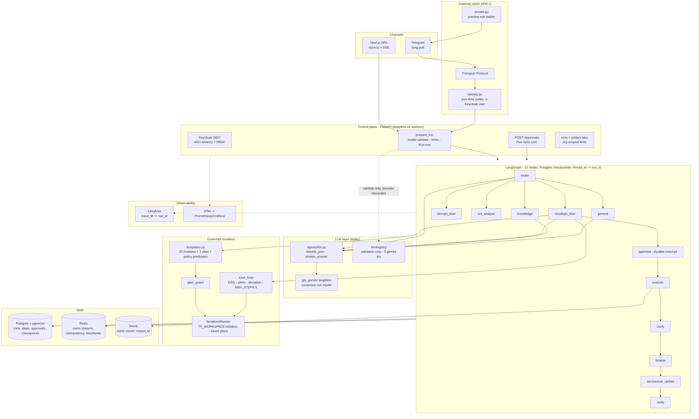
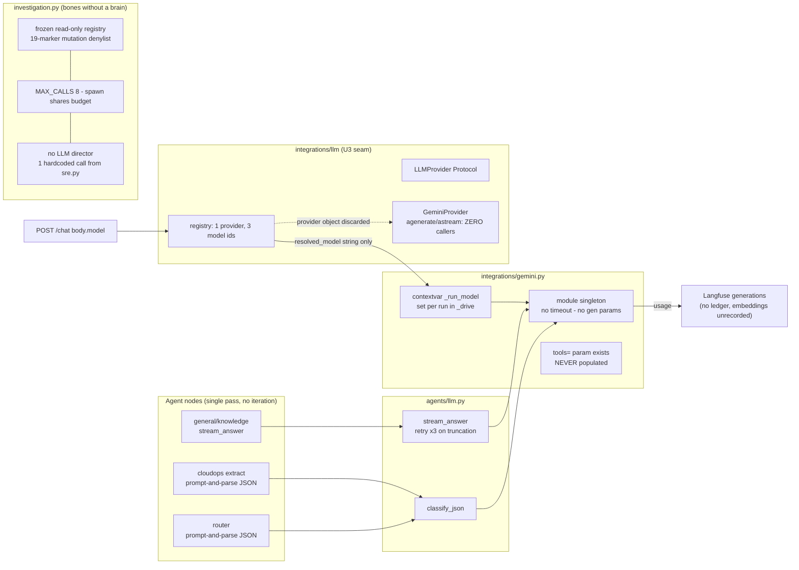
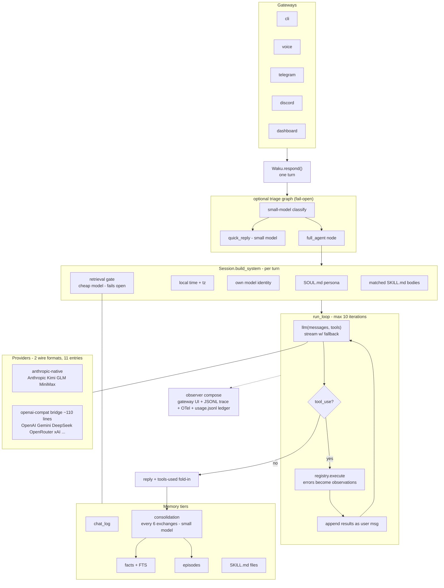
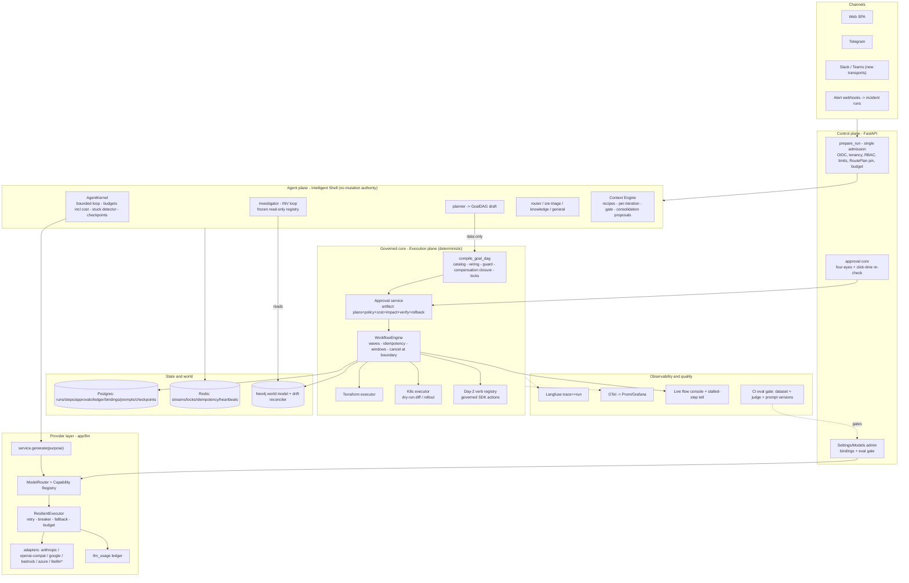
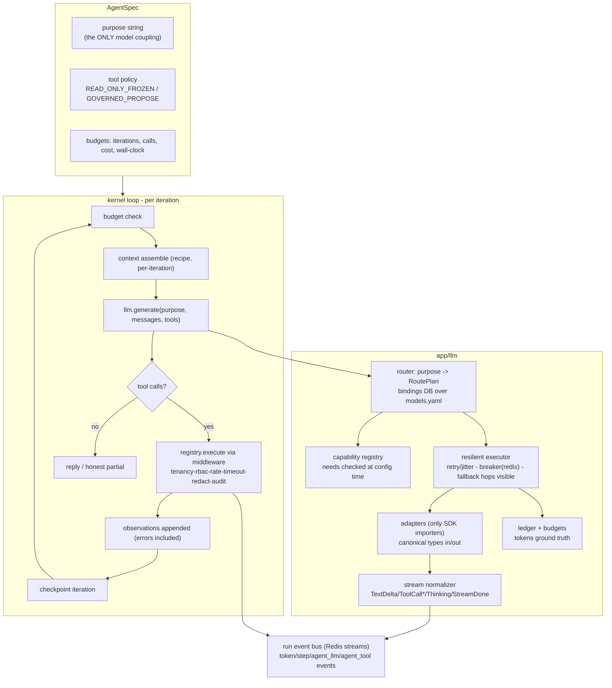
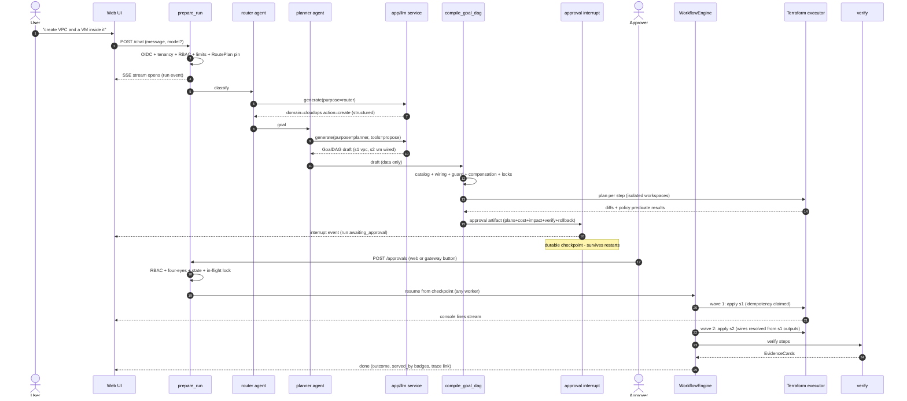
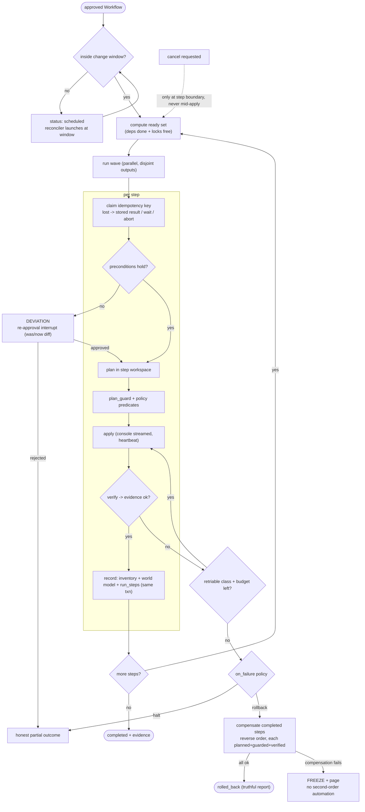
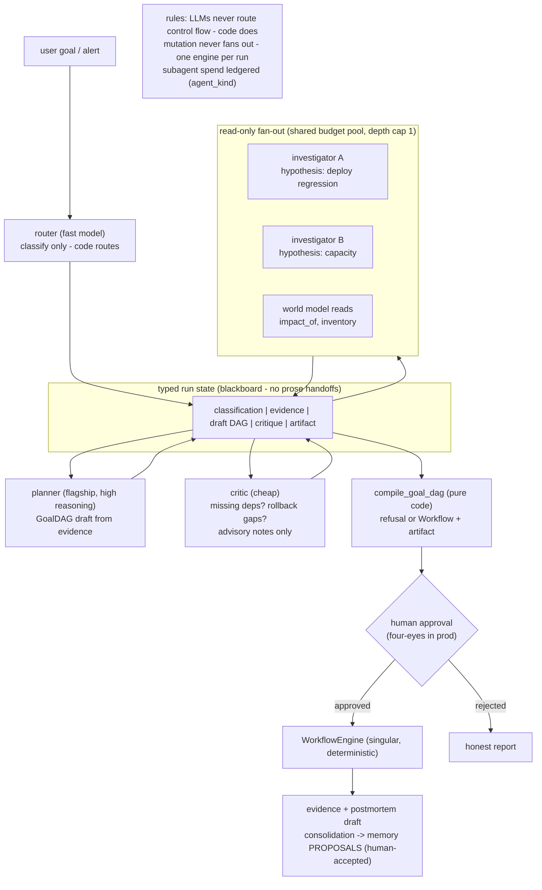

# Architecture Diagrams

> Eight Mermaid diagrams. 1–3 describe what exists (audited at `a974290`); 4–8 describe
> the target. Render on GitHub, VS Code Mermaid preview, or mermaid.live.

---

## 1. Current AegisOps Architecture

---

## 2. Current Harness (the honest close-up)

Key facts the diagram encodes: model selection is real but string-only (the provider
object is discarded); all inference flows through one singleton; native tool-calling
is absent; the read-only tool registry has no director; tokens go to Langfuse only.

---

## 3. Waku Harness

---

## 4. Proposed AegisOps Architecture

---

## 5. Proposed Agent Harness (kernel + provider layer close-up)

---

## 6. End-to-End Request Flow (provisioning with approval)

---

## 7. CloudOps Execution Flow (engine step lifecycle + saga)

---

## 8. Multi-Agent Flow (bounded fan-out, typed blackboard)

