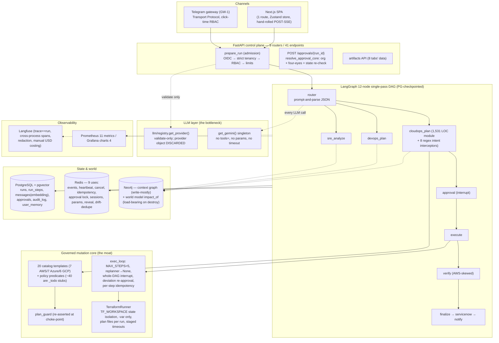

# 01 — Current-State Architecture (audited at `a974290`)

> Method: source-level audit of `aegisops_production_kit/` at HEAD `a974290` (branch
> `feature/cloudops-v3`), cross-checked against the prior audit in `Brainstorming/` and re-verified
> by a fresh sweep for this document. Every claim cites `file:line`. Filenames and docstrings were
> not trusted; execution paths were traced. Paths are relative to `aegisops_production_kit/`.
>
> Scale: backend `app/` ≈ 17,892 LOC · backend `tests/` ≈ 13,801 LOC (741 test functions, 99 files)
> · frontend ≈ 4,080 LOC · Terraform catalog 21 module dirs.

---

## 1. What AegisOps is today

A multi-tenant, governed CloudOps platform: **FastAPI + LangGraph + Next.js**, with PostgreSQL
(+pgvector), Redis, Neo4j, Keycloak OIDC, Langfuse, Prometheus/Grafana, and a Terraform-only
mutation path. One compiled, single-pass, 12-node LangGraph DAG executes every run:

```
START → router →(conditional)→ cloudops_plan | devops_plan | sre_analyze | knowledge | general
plan nodes →(conditional)→ approval | finalize | general
approval →(decision)→ execute | finalize ;  execute → verify → finalize
finalize → servicenow_update → notify → END
```

- Nodes registered at `agents/graph.py:83-94`; edges `graph.py:96-108` — **no backward edge exists**;
  no node can observe a result and re-decide.
- Durable checkpointing: `AsyncPostgresSaver` (`agents/checkpointer.py:35`), `thread_id == run_id`
  (`agents/runner.py:41`) — the approval interrupt survives restarts and resumes cross-process.
- Interrupt sites (3): approval gate (`agents/approval.py:59`), whole-DAG approval
  (`agents/exec_loop.py:154-162`), deviation re-approval (`exec_loop.py:301-311`).

### 1.1 Current architecture diagram



---

## 2. Layer-by-layer findings

### 2.1 Frontend (`frontend/`, 4,080 LOC)

- **One route.** `app/page.tsx` (5 LOC) → `AppRoot`; the whole product is a single client-side shell.
  10 components; largest: `Workspace.tsx` 553, `Sidebar.tsx` 443, `TopNav.tsx` 379.
- **SSE:** hand-rolled POST-based reader (`lib/sse.ts:29`) feeding a 10-case switch in the Zustand
  store (`lib/store.ts:343-390`). The **approval continuation uses a second, reduced handler**
  (`store.ts:432-455`) that drops `analysis`, `reference`, `confidentiality`, and `params` frames —
  anything the backend emits during a post-approval apply in those categories never renders. [F-13]
- **Model menu is a hardcoded 3-entry literal** (`lib/data.ts:41-45`) with a comment admitting it
  must be manually synced; `GET /models` exists (`api/integrations.py:114`) and nothing calls it. [F-4]
- **State:** one flat Zustand slice, 491 LOC, ~28 fields + ~30 actions; no query library.

### 2.2 API surface (9 routers, 41 endpoints)

Routers: ops (`/healthz`, `/readyz` — no auth), auth (5), integrations (2), chat (5: `POST /chat`
`require_initiator`, `POST /approvals/{id}` `require_approver`, stream, get, cancel), sessions (7),
artifacts (9, incl. `POST credentials` with step-up re-auth), modules (11, incl. MPP proposal
pipeline + user-memory CRUD), knowledge (2), gateways (3, Telegram link lifecycle).
**`GET /metrics` is mounted unauthenticated** (`main.py:198`). [F-16]

### 2.3 The LLM layer — a validation-only seam over one singleton

- `get_provider()` is called exactly once (`api/chat.py:259`) and its provider object is discarded
  (`_provider, resolved_model = …`); only the resolved model id survives into a contextvar
  (`chat.py:319,330`). `GeminiProvider.agenerate/astream` (`integrations/llm/gemini_provider.py:47,52`)
  have **zero callers**. Every real call goes through the `get_gemini()` singleton
  (`agents/llm.py:34,44,73` → `agenerate` at `:39,:49`, `astream` at `:97`). A second provider
  requires rewriting `agents/llm.py`.
- **Zero native tool calling.** `tools=` appears once in the entire backend — the Gemini config
  builder (`integrations/gemini.py:103`) — and no caller populates it. Router and extraction are
  prompt-and-parse JSON. The `CLAUDE.md` claim of "native tool-calling" is aspirational; so is
  `gemini.py:3`'s docstring. [F-mislabel]
- **No generation parameters anywhere**: grep for `temperature|max_output_tokens|top_p|top_k|
  thinking_config|safety_settings` over `backend/app/` → zero hits. No per-call timeout (retry only:
  `stop_after_attempt(3)`, `gemini.py:133,163`).
- **One model per run, no purposes.** Router, planner, extraction, chat all read the same contextvar.
  No cheap-model tiering, no reasoning-effort control.

### 2.4 Reasoning topology — nothing can iterate

- The graph is single-pass (§1). The only loop-shaped code in the backend is `exec_loop.py`, which is
  deliberately non-agentic: `MAX_STEPS=5`, `MAX_REPLANS_PER_STEP=1` (`exec_loop.py:36-37`), and the
  default replanner is `lambda step, observation: None` (`:46`) — **no replan ever occurs**; a failed
  step halts with an honest partial (`_partial_outcome`, `:334-354`).
- The investigation registry (`agents/investigation.py`) is a genuinely well-designed safe surface —
  registration-time mutation denylist (`:49-56`), freeze (`:156` / raise at `:67`), `MAX_CALLS=8`
  (`:28`), budget-sharing `spawn()` — but it has **no LLM director**. Its sole production caller is
  one hardcoded `inv.call("list_deployments", namespace="default")` (`sre.py:84-85`).
  `Investigator.run()` and `.spawn()` have **no production callers at all** — dead API surface.
- Net: AegisOps cannot chase a symptom across three tools and revise a hypothesis, anywhere, even on
  read-only paths where it would be safe.

### 2.5 Governed mutation core (the moat — keep)

- **20 catalog templates** (`agents/templates.py:455-478`): AWS s3/vpc/eks/rds/ec2/nlb/kms; Azure
  storage/vnet/keyvault/resource_group/vm/db/aks; GCP gcs/vpc/kms/vm/gke/cloudsql. (21 dirs on disk;
  the 21st is `demo-null`.)
- Terraform-only mutation: `tools/terraform.py` (492 LOC) — per-resource state isolation via
  `TF_WORKSPACE` env (`:167`, rationale `:126-133`), vars strictly `-var`, plan-file lifecycle +
  stray-plan sweeps (`:46,:67,:94`), staged timeouts (plan 600s / apply 2700s, `settings.py:207-208`)
  with process-group kill (`tools/console.py:97`).
- `plan_guard` re-asserted at the approval choke-point (`agents/approval.py:44`).
- exec_loop invariants worth preserving verbatim: catalog-only DAG validation, output-wiring grammar
  (`"<out>"`, `"<out>[i]"`, `"input:<field>"`), single whole-DAG interrupt, deviation re-approval,
  per-step idempotency claims, boundary-only cancel, honest partial reporting.
- **Two honesty caveats:**
  1. Policy predicates are largely unverifiable by construction: `templates.py:45 _todo()` returns
     `evaluated: False`, and ~40 of the catalog's policy rows are `_todo` stubs vs. the `_ck` real
     predicates. Promoted MPP modules get a *single blanket* `_todo_policy` row
     (`module_pipeline.py:55-57`) — dynamically promoted modules have effectively zero machine
     policy enforcement. [F-11]
  2. A **runtime-HCL path exists**: `module_pipeline._materialize` (`:197`) writes caller-supplied
     HCL into `infra/terraform-workspaces/promoted-<key>/` and `_register` (`:207`) adds it to the
     live registry — human-review + checkov/tfsec gated, but the "no runtime HCL" claim
     (`exec_loop.py:95`) holds only for un-promoted HCL.

### 2.6 Cloud integrations — coverage is asymmetric and thin

All read-only, `anyio.to_thread`-wrapped:

| Cloud | File (LOC) | Read coverage | Gap vs. write catalog |
|---|---|---|---|
| AWS | `tools/aws.py` (137) | VPC, subnets, EKS (list+describe), RDS, EC2, S3 (+name check) — 6 services | best covered |
| Azure | `tools/azure.py` (89) | resource groups, VNets, VMs, ping — 3 services | **no AKS/Storage/DB reads** despite 7 Azure templates |
| GCP | `tools/gcp.py` (79) | networks, instances, ping — 2 services | **no GCS/GKE/CloudSQL reads** despite 6 GCP templates |
| vSphere | `tools/vmware.py` (84) | list VMs | orphan — no template targets it |
| K8s | `tools/kubernetes.py` (155) | namespaces, deployments, pods | **the only SDK that mutates**: apply/restart/scale/rollback deployment |

Consequence: discovery/verification/drift are heavily AWS-skewed relative to the symmetric 7/7/6
write catalog — Azure and GCP resources can be *created* but barely *seen*. [F-12]

### 2.7 DevOps — narrower than its labels

- `tools/github.py` (184 LOC, PyGithub): repo get/exists/ensure, `upsert_file`,
  `create_pull_request` (**never called by any agent**), `dispatch_workflow` +
  `find_dispatched_run` (workaround for dispatch returning no run id), `get_run`,
  `poll_run_to_completion` (600s). **No log download, no re-run, no check-runs API.**
- `agents/devops.py` (223 LOC): 6 declared stages, 4 real. `ENSURE_IMAGE_EXISTS` actually just polls
  the CI run to completion (`devops.py:186-195`) — it never inspects a registry; `ENSURE_K8S_DEPLOYED`
  applies a hardcoded manifest (`:216`). The committed scaffolding it pushes into customer repos is
  placeholder-grade: a Dockerfile running `python -m http.server 8080` with
  `pip install … || true` (`:33-38`), and a CI workflow that only runs `docker build` — no push, no
  tests, no auth (`:40-49`). Pushes go straight to the branch; no PR flow. [F-14]

### 2.8 SRE — real signals, fixed pipeline, one self-referential metric

- `agents/sre.py` (213 LOC): telemetry → RAG runbooks (k=4) → deterministic `decision_matrix`
  (`:36-48`: error_rate>0.05+recent_deploy→rollback; cpu>0.85→scale_out; restarts>3→restart) → LLM
  narrative → conditional approval interrupt → `sre_execute` (restart/scale/rollback; honest
  `proposed_not_executed` without kubeconfig).
- **All 5 PromQL queries hardcoded** (`sre.py:59-71`), and the "error_rate" signal reads
  `aegisops_api_requests_total` — **AegisOps' own API metric, not the monitored service's** — so
  incident triage of a customer service keys off the platform's own 5xx ratio. [F-15]
- Thresholds are global constants; no per-service/org tuning.

### 2.9 Memory

- Substrate is strong: `messages` carries a pgvector `embedding` (`db/models.py:105`),
  confidentiality level/score, correlation ids. Transcript budgeting is genuinely good: 70% recent
  verbatim / 30% digest-of-every-older-user-turn (`agents/memory.py:218,229-239`), exact positional
  recall, semantic retrieval with `pg_trgm` fallback, per-purpose char budgets.
- Weaknesses: retrieval fires **unconditionally** every turn (`memory.py:286-289`, k=3, no gate);
  **no fact/episodic/procedural tier** above the transcript; `user_memory` is written only by humans
  (`user_memory.py:32` ← `PUT /memory/{key}`, `api/modules.py:340`); context assembles once per
  graph node, never per observation (there are no observations to react to).

### 2.10 Neo4j — one load-bearing feature, one write-only audit trail

- **Context graph** (`graph_db/context_graph.py`, 266 LOC): written from 8 modules, read by
  essentially one path (`resource_provenance`, `inventory.py:281`); every write is wrapped in a
  swallowing try/except. Peripheral: an outage costs only audit fidelity.
- **World model** (`world_model.py`, 214 LOC): `impact_of` (`:157`) gates destroys
  (`cloudops.py:1105-1107`) and is a registered investigation tool. Load-bearing on the destroy
  path; degrades to nothing when Neo4j is down.

### 2.11 Redis — 9 distinct uses

Event bus (Streams, `events.py:82`; default `memory`, compose posture `redis`) · run heartbeat
(45s TTL / 15s refresh) · cooperative cancel flag · idempotency claim/result store · approval
in-flight lock (`chat.py:478`) · server-side auth sessions + PKCE state · pending-parameter cache ·
credential-reveal one-shot claim · drift dedupe (24h NX).
**Rate limiting is NOT Redis-backed** — slowapi in-memory per process (`ratelimit.py`), so the
documented api+api-b posture doubles every limit. [F-17]

### 2.12 Observability

- **Langfuse** (`integrations/langfuse_client.py`, 339 LOC, SDK v2): trace==run_id, deterministic
  span ids closable cross-process, generations with manual USD costing, redaction on every payload,
  wrong-project key detection (`assert_project`, `:286`). Degrades to no-op when unconfigured.
- **Prometheus:** 11 metrics defined (`app/metrics.py`); 7 alert rules. **Grafana charts only 4** of
  the 11 — approval wait, drift, stranded runs, dependency-up, RAG latency, step duration are
  exported and alerted on but never dashboarded.
- **The approval-wait metric has never recorded an observation**: `resolve_approval_core` calls
  `select(RunStep)` at `chat.py:465` but `select` is only imported *locally* inside another function
  (`chat.py:105`) — a latent `NameError` swallowed by `try/except` (`chat.py:468`), logged as
  `approval.wait_metric_failed`, invisible on any dashboard. [F-10]
- Tokens/cost exist **only inside Langfuse** (priced from `settings.gemini_cost_per_1m_*`); no
  ledger table; embedding calls are recorded nowhere at all.

### 2.13 Background jobs & process topology

- RunSupervisor (heartbeats, drain), Reconciler (60s sweep: checkpoint-resumable redrive or honest
  failure; TF-plan hygiene; orphan sweep), retention sweeper (all windows default 0 = off),
  Telegram long-poller.
- **No dedicated worker container**: every background loop runs inside every API replica; with
  api+api-b, two reconcilers and two retention sweepers race the same rows (idempotent, but
  duplicated work and two writers to the `aegisops_stranded_runs` gauge). [F-18]

### 2.14 Configuration & governance drift

- `settings.py`: one flat `BaseSettings`, ~90 fields. Key defaults: `tenancy=strict`,
  `event_bus=memory`, `exec_loop=off`, `four_eyes_for_production=True`, `telegram=off`,
  `drift=off`, `default_execution_mode=plan`.
- **This install's `.env` diverges from code defaults on three governance-relevant flags**:
  `AEGISOPS_FOUR_EYES_FOR_PRODUCTION=false` (`.env:126`), `AEGISOPS_EXEC_LOOP=on` (`.env:139`),
  `AEGISOPS_TELEGRAM=on` (`.env:146`). Net effect: four-eyes disabled while the multi-step mutation
  loop and an external chat channel are enabled — a silently weakened posture visible nowhere in
  the product. [F-9]
- `AEGISOPS_COST_GUARDRAIL_USD` is read via raw `os.getenv` (`agents/cost.py:74`) and exists in
  neither `settings.py`, `.env`, nor `.env.example` — the cost guardrail is undiscoverable and
  effectively permanently off. [F-19]

### 2.15 Tests & CI

741 backend test functions across 99 files (tenancy 599 LOC, safety invariants 330 LOC, GW-1
suites, STAB, PR-1..7); 8 Vitest + 10 Playwright specs. CI: 5 jobs (ruff+pytest, frontend
lint/typecheck/vitest/build, compose config, checkov+tfsec, pip-audit+npm audit).
**Zero behavioral coverage**: no eval dataset, no judge, no score-gated release — a router-prompt
quality regression ships silently. No Playwright job in CI, no coverage gate, no migration check.

### 2.16 Security & credentials

- Strict tenancy is real (refusal semantics, cross-org 404s), 8 roles / 3 capability tiers,
  step-up re-auth for credential reveal, 7-pattern redaction applied at persist/console/Langfuse.
  No hardcoded secrets in `app/` or `frontend/`; `.gitignore` is correct and `git ls-files` clean.
- **Cloud credentials are global, single-tenant, env-only**: `terraform.py:170-187 _env()` injects
  one set of long-lived AWS/ARM/GCP keys from `Settings` for every tenant's provisioning. No
  per-org scoping, no AssumeRole/workload identity, no vault. Multi-tenancy stops at the Postgres
  boundary and does not extend to the cloud blast radius. [F-20]
- **On-disk residue in the working tree** (untracked but present): a GCP service-account key at
  `infra/secrets/gcp-sa.json`, a Postgres dump, live `terraform.tfstate` under
  `aws-ec2/.stale_aside/` and `terraform.tfstate.d/res-accept-web3/`, two orphan `.tfplan` files.
  Also `infra/keycloak/realm-export.json` **is tracked** — must be confirmed secret-free. [F-21]

---

## 3. Consolidated defect register

Carried defects D1–D9 from the prior audit remain open at `a974290`; this audit adds F-10…F-21.

| # | Defect | Evidence |
|---|---|---|
| D1 | One-click region retry unreachable: classifier emits `bad_location`, `suggest_retry` matches `bad_region` | `provider_errors.py:115` vs `:142` |
| D2 | Dead lazy-model fallback; discarded `models.list()` call | `gemini.py:75-108` |
| D3 | Embedding calls invisible in every sink | `gemini.py:164-173` |
| D4 | Frontend model menu hardcoded; `GET /models` uncalled | `frontend/lib/data.ts:41-45` |
| D5 | `"applying"` status read in 5 places, written by nothing | `chat.py:116,137,152`; `reconciler.py:33,100`; `artifacts.py:234` |
| D6 | Gateway turns hardcode `model=None`, undocumented | `gateways/driver.py:201-203` |
| D7 | Dead code: `agents/llm.py:generate()`, `GeminiProvider.astream/agenerate`, `gemini.astream_text`, `Investigator.run/spawn`, `github.create_pull_request`, `runs.ended_at` (declared, never assigned) | multiple |
| D8 | Hardcoded `passed: True` policy rows in DevOps/SRE cards | `devops.py:102-105`, `sre.py:146` |
| D9 | `.env` governance drift (four-eyes off, exec loop on, Telegram on) | `.env:126,139,146` vs `settings.py:47,49,165` |
| F-10 | Latent `NameError` (module-level `select` missing) silently kills `aegisops_approval_wait_seconds` — it has never observed | `chat.py:465,468` vs `:105` |
| F-11 | ~40 `_todo()` policy stubs on approval cards; promoted modules get one blanket `_todo_policy` | `templates.py:45`, `module_pipeline.py:55-57` |
| F-12 | Read/verify coverage asymmetric: AWS 6 services, Azure 3, GCP 2 vs 7/7/6 write catalog | `tools/{aws,azure,gcp}.py` |
| F-13 | Approval-continuation SSE handler drops `analysis`/`reference`/`confidentiality`/`params` frames | `frontend/lib/store.ts:432-455` |
| F-14 | DevOps pushes placeholder Dockerfile/CI into customer repos; no PR flow; "image exists" = CI poll | `devops.py:33-49,165-166,186-195` |
| F-15 | SRE error-rate signal reads AegisOps' own API metric, not the target service's | `sre.py:59-71` |
| F-16 | `GET /metrics` unauthenticated | `main.py:198` |
| F-17 | Rate limit in-memory per worker — doubled under api+api-b | `ratelimit.py` |
| F-18 | Every API replica runs its own reconciler/retention sweeper — duplicated sweeps and gauge writers | compose override + `main.py` |
| F-19 | `AEGISOPS_COST_GUARDRAIL_USD` undiscoverable (raw `os.getenv`, absent from settings/.env/.env.example) | `cost.py:74` |
| F-20 | Cloud credentials global + long-lived, shared by all tenants; no AssumeRole/vault | `terraform.py:170-187` |
| F-21 | Secrets/state residue in working tree (GCP SA key, DB dump, live tfstate, orphan tfplans); tracked Keycloak realm export to verify | `infra/secrets/`, `infra/terraform-workspaces/` |
| F-22 | Drift subsystem dormant and AWS-EC2-only (1 of 20 types) | `drift.py:118-124`, `settings.py:44` |

---

## 4. Structural deficiencies (what the redesign must dissolve)

These are not bugs; they are architecture.

1. **No iterative reasoning anywhere.** Single-pass DAG; empty director seat over the safe
   investigation registry; replanner that returns `None`. The platform cannot observe → diagnose →
   re-plan, even where it would be safe.
2. **The LLM layer validates but does not dispatch.** One Gemini singleton behind a discarded
   provider seam; a second provider is a rewrite, not a config change.
3. **Zero native tool calling.** Prompt-and-parse JSON everywhere; `tools=` never populated.
4. **One model per run; no purposes; no generation params; no per-call timeout.**
5. **Domain agents are fat, not thin.** `cloudops.py` alone is 1,531 LOC (8.5% of the backend) mixing
   planning, regex intent interception, execution glue, and verification; routing logic is split
   between the LLM router and 8 regexes.
6. **No cost ledger, no enforceable budgets.** Tokens only in Langfuse; the one cost guardrail env
   var is unreachable in practice; nothing can stop a run on spend.
7. **Memory has no tiers above the transcript and no gate.** Nothing ever promotes operational
   lessons into durable knowledge; retrieval is unconditional.
8. **No behavioral eval gate.** 741 tests, none of which notice a routing/quality regression.
9. **Verification is uneven and tool-success-shaped.** AWS-skewed SDK reads; Azure/GCP mostly
   unverifiable; no evidence-card concept; DevOps "verification" is a CI poll.
10. **Multi-cloud is write-symmetric but read/verify/drift-asymmetric** — the platform can create
    what it cannot subsequently see, verify, or detect drifting.
11. **Multi-tenancy ends at the database.** All tenants mutate clouds through one global credential
    set.
12. **Governance posture can silently drift via `.env`** — approvers cannot see that four-eyes is
    off.

## 5. What must be preserved

The governance core audited here is genuinely strong and survives the redesign unchanged in
semantics (per the constitution in `00-Redesign-Mandate.md §7`): Terraform-only mutation through
the approved catalog · durable cross-process approval interrupt · plan_guard at the choke-point ·
strict tenancy/RBAC/four-eyes (re-enabled) · per-step idempotency · boundary-only cancel · honest
partials · redaction on every egress · trace==run · immutable Approval rows · the investigation
registry's read-only boundary (denylist + freeze + shared budgets) · TF state-workspace isolation ·
supervisor/reconciler crash recovery · GW-1's transport seam with click-time re-checks.

## 6. Current technology roles (input to ADRs, `08`)

| Tech | Current role (audited) |
|---|---|
| PostgreSQL | System of record: runs/steps/messages/approvals/audit + LangGraph checkpoints. Healthy. |
| pgvector | `messages.embedding` (768-d pinned) + document chunks; semantic retrieval w/ trgm fallback. Healthy, dimension-pinned. |
| Redis | 9 distinct uses (§2.11); availability-critical, not integrity-critical. Healthy; rate-limit gap. |
| Neo4j | Write-mostly context graph (peripheral) + world-model `impact_of` (load-bearing on destroys only). Under-read. |
| LangGraph | 5 APIs used: StateGraph/compile, interrupt, AsyncPostgresSaver, Command(resume), aget_state — i.e., **used as a durable checkpoint/interrupt substrate, not as an agent framework**. No Send/subgraphs/streams/store. |
| LangChain | **One import** (`HumanMessage`, `chat.py:28`) — transitively required by LangGraph anyway. Effectively absent. |
| Terraform | The mutation engine; catalog + state isolation + plan artifacts. Load-bearing and correct. |
| Langfuse | Real tracing depth (trace==run, cross-process spans); also the *only* home of cost data — a misuse of a trace store. |
| Prometheus | 11 real metrics, 7 alerts; one metric dead (F-10). |
| Grafana | 1 dashboard, 4 of 11 metrics charted. Under-used. |
| FastAPI | Control plane; stateless, 2-worker proven. Healthy. |

Verdicts and target responsibilities live in `08-Architecture-Decision-Records.md`.
