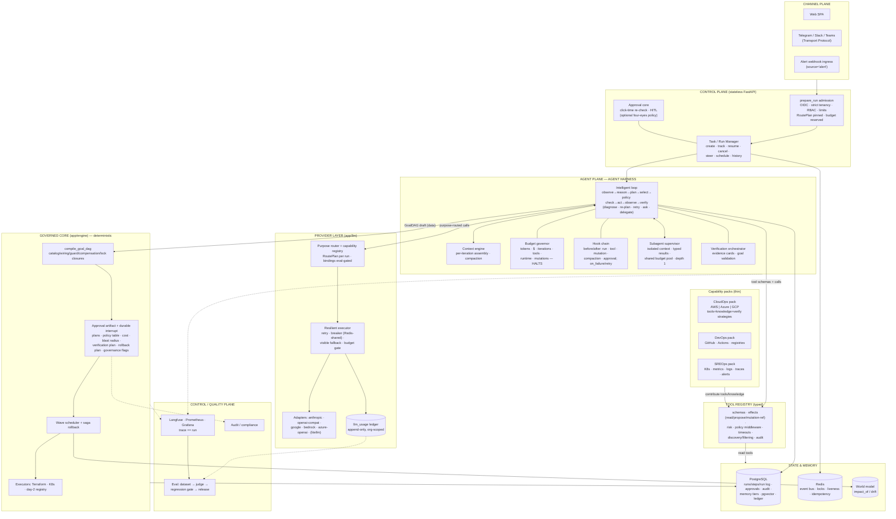
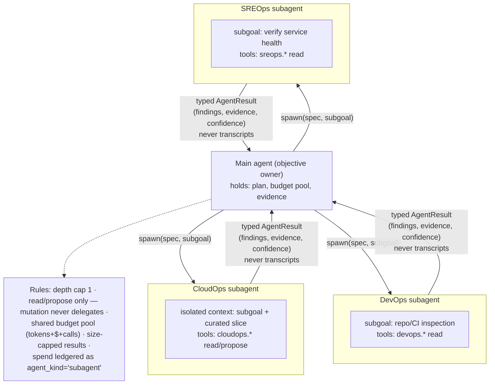
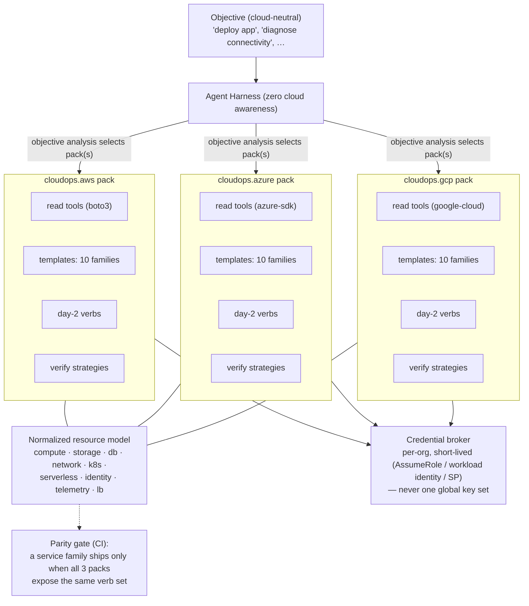

# 02 — Redesigned Architecture

> The target system. Boundaries inherited from `00-Redesign-Mandate.md`; current-state grounding
> from `01-Current-State-Architecture.md`. Detailed specifications live in 04 (harness), 05
> (contracts), 06 (memory/execution); this document fixes the shape.

---

## 1. Design principles

1. **Harness-first.** Generic intelligence and runtime capability (loop, model routing, tool
   execution, memory, budgets, hooks, subagents, verification orchestration, durable runs) live in
   the harness. Domains contribute knowledge, tools, and verification strategies — never control
   flow. Nothing like today's 1,531-line `cloudops.py` may exist in the target.
2. **Split-trust preserved.** The Intelligent Shell (LLM-driven, zero mutation authority) proposes;
   the Governed Core (deterministic engine) executes. The LLM proposes *data* — objective plans and
   catalog-template steps — never HCL, never executor choices, never credentials.
3. **Thin specialists, one kernel.** CloudOps, DevOps, SREOps are *capability packs*: tool sets +
   prompt/knowledge fragments + verification strategies + policy metadata, mounted onto the same
   agent kernel. A capability pack contains no loop, no SDK dispatch logic, no bespoke planners.
4. **Cloud-neutral core, symmetric packs.** The harness has zero AWS/Azure/GCP awareness. Parity is
   enforced per service family (03 §3.4) — no primary-cloud-plus-adapters design.
5. **Policy is code evaluated per action, not prose in prompts.** Every action selection passes the
   policy engine; permission modes change the gate, never the tools. LLMs may raise risk severity,
   never lower it (Hermes lesson).
6. **Budgets are enforced inside the loop.** Token/cost/iteration/tool/runtime/mutation budgets can
   halt any run at a safe boundary with an honest partial.
7. **Errors are data; exceptions never cross layer boundaries** (Pi/Waku lesson). Failed tool calls,
   provider faults, and policy denials all become observations the model reasons over.
8. **Evidence over claims.** Verification produces evidence cards from independent reads; goal
   validation closes every objective. Tool success ≠ task success.
9. **The run log is the source of truth.** Context windows, UI tabs, and resumability are all
   projections of a durable, append-only run record (Pi/OpenHands lesson).
10. **Minimal framework surface.** Every framework is re-justified in 08; none is load-bearing for
    identity ("we use X" is never an architecture).

## 2. The plane model

```
┌────────────────────────────────────────────────────────────────────────┐
│ CHANNEL PLANE      Web SPA · Telegram · Slack/Teams · Alert webhooks   │
│                    (Transport Protocol; identity per interaction)      │
├────────────────────────────────────────────────────────────────────────┤
│ CONTROL PLANE      FastAPI (stateless N workers)                       │
│                    prepare_run admission · Task/Run Manager ·          │
│                    approvals API · artifacts API · settings/models     │
├────────────────────────────────────────────────────────────────────────┤
│ AGENT PLANE        AGENT HARNESS (the kernel)                          │
│  (Intelligent      loop · context engine · tool mediation · budgets ·  │
│   Shell — zero     hooks · subagents · policy checkpoints ·            │
│   mutation         verification orchestration                          │
│   authority)       + capability packs: CloudOps | DevOps | SREOps      │
├────────────────────────────────────────────────────────────────────────┤
│ PROVIDER LAYER     app/llm — canonical types · purpose router ·        │
│                    capability registry · resilient executor ·          │
│                    adapters (6 wire families) · usage ledger           │
├──────────────────────── the trust boundary ────────────────────────────┤
│ GOVERNED CORE      app/engine — compile_goal_dag · approval service ·  │
│  (deterministic)   wave scheduler · saga/compensation ·                │
│                    executors: Terraform | K8s | day-2 verbs            │
├────────────────────────────────────────────────────────────────────────┤
│ STATE & MEMORY     PostgreSQL (system of record + run log + ledger +   │
│                    memory tiers + pgvector) · Redis (bus/locks/        │
│                    liveness) · world model (impact graph)              │
├────────────────────────────────────────────────────────────────────────┤
│ CONTROL/QUALITY    Langfuse traces · Prometheus/Grafana · audit ·      │
│ PLANE              eval datasets · judge · regression gate · release   │
└────────────────────────────────────────────────────────────────────────┘
```

### 2.1 Target architecture diagram



Key correction vs. the user-supplied reference diagram (§7): the loop mediates the model↔tool
exchange — specialists never "call tools then models"; the harness sends tool schemas with each
model call, the model selects, the harness executes through the registry under policy.

## 3. The Agent Harness (summary — full spec in 04)

One kernel runs every agent. An agent is an `AgentSpec` — purpose (model coupling), system prompt
ref, tool policy, budgets, context recipe — never a class with its own loop.

The loop per iteration: budget check → context assembly → model call (native tool calling, purpose-
routed) → for each requested action: **policy check → execute → observation** (errors included) →
verification hooks → checkpoint → continue | answer | ask | delegate | halt-on-budget. Durable:
each iteration checkpoint lands in the run log; the reconciler can resume a stranded loop on
another worker.

What dissolves into it: the router node (becomes a fast-purpose classification call inside
admission), the plan nodes (planning is loop reasoning + a `propose_goal_dag` tool), the fat domain
agents (become packs), `exec_loop`'s replanner fiction (deviation proposals from real diagnosis).

## 4. Specialists as capability packs

```
CapabilityPack {
  name: "cloudops.aws" | "cloudops.azure" | "cloudops.gcp" | "devops.github" | "sreops.k8s" | …
  tools:        [ToolDef]          # read-effect SDK tools + propose-effect tools
  knowledge:    [PromptFragment]   # domain guidance, injected on activation
  playbooks:    [ProcedureRef]     # governed procedural memory (diagnosis playbooks)
  verify:       [VerifyStrategy]   # per resource type: evidence-producing checks
  templates:    [TemplateKey]      # catalog templates this pack can propose
  day2:         [Day2VerbKey]      # lifecycle verbs this pack can propose
  policies:     [PolicyFragment]   # risk metadata, per-service constraints
}
```

Packs are activated by objective analysis (which clouds/domains does this objective touch?), not by
a router branch. Multiple packs compose in one run (EKS + GitHub deploy = cloudops.aws + devops.
github + sreops.k8s). Packs are data + registrations; the kernel provides all behavior.

## 5. Subagent architecture



## 6. Multi-cloud architecture



The normalized resource model is what makes cross-cloud objectives (compare, locate, migrate)
first-class: packs map native resources into it; comparison/inventory tools operate on it.
Credential brokering per org (F-20) is a target requirement, phased in 07.

## 7. Review of the user-supplied reference diagram

`Architecture_reference-diagram.png` was reviewed against the audited current state and this
target. **Verdict: the skeleton is correct and adopted** — harness between memory/policy pillars
and specialists; Task/Run Manager above the harness with resume/idempotency/cancellation; one
shared tool registry under all specialists; model provider layer as substrate with router/fallback/
cost-awareness; MAPE+V loop with retry/replan/ask/delegate; sync/async/data legend discipline.

Gaps corrected in this suite:

| # | Gap in the diagram | Fixed where |
|---|---|---|
| G1 | Verification only a loop stage, not a subsystem (evidence cards, goal validation) | 02 §2.1, 04 §7 |
| G2 | No budget *enforcement* component — cost drawn as passive telemetry | Budget governor in the harness (04 §5) |
| G3 | Subagent structure invisible ("delegate" is one word) | §5 above |
| G4 | Implies specialists→tools→models sequencing; runtime is loop-mediated model↔tool exchange | §2.1 note |
| G5 | Memory box conflates tiers with stores (Redis/PG/Neo4j drawn as memory types) | 06 §1 (tiers) vs §5 (stores) |
| G6 | Skills missing as a first-class harness asset | 06 §3 (procedural tier, governed) |
| G7 | Hooks missing | 04 §6 |
| G8 | Eval plane not wired (no Trace→Evaluate→Gate→Release loop) | 04 §9 |
| G9 | Neo4j pre-committed as "Graph memory" | ADR-06 (decision-gated) |
| G10 | Other/Custom agents (FinOps/Compliance/…) read as v1 scope | marked future; packs make them cheap later |
| G11 | Infrastructure row (CDN/multi-AZ/backups) dilutes an agent-architecture diagram | deployment concerns → 07 |
| G12 | No permission-mode concept (READ_ONLY/…/AUTONOMOUS) | 03 §6.1, 04 §8 |
| G13 | Channel rail omits Telegram/Slack gateway seam (an existing strength, GW-1) | §2.1 channel plane |
| G14 | Model list omits OpenRouter/Ollama/OpenAI-compatible | provider layer names them (04 §4) |

## 8. Representative workflow (target behavior)

*"Create an EKS cluster and deploy the application from my GitHub repository."*

```mermaid
sequenceDiagram
    autonumber
    actor U as User
    participant CPl as Control plane
    participant H as Harness loop
    participant D as DevOps subagent
    participant C as CloudOps tools (read)
    participant P as Policy engine
    participant A as Approver
    participant E as Engine (TF/K8s)
    participant S as SREOps verify

    U->>CPl: objective (chat)
    CPl->>CPl: admission: tenancy·RBAC·limits·RoutePlan·budget
    CPl->>H: start run (durable)
    H->>D: spawn: inspect repo (Dockerfile? manifests? workflows?)
    D-->>H: AgentResult{buildable, image target, deploy needs}
    H->>C: inspect AWS: region, VPCs/subnets, IAM, existing EKS, TF state
    C-->>H: observations (incl. failures as observations)
    H->>H: reason: requirements known? → plan GoalDAG draft
    alt genuinely missing info
        H->>U: ask (only what discovery cannot answer)
        U-->>H: answer (steering queue)
    end
    H->>P: policy check (mode, risk class, env)
    H->>E: propose_goal_dag (data only)
    E->>E: compile: catalog/wiring/guard/compensation/lock closures
    E->>A: approval artifact (plans·policy·cost·blast·verify·rollback·flags)
    A-->>E: approve (HITL — initiator may approve; optional four-eyes policy)
    E->>E: wave execution: VPC→EKS→deploy · idempotent · observed
    alt step failure
        E->>H: failure observation
        H->>H: diagnose → gather evidence → re-plan
        H->>E: deviation proposal → re-approval → retry
    end
    E->>S: verification plan
    S-->>E: evidence cards (cluster healthy, rollout complete, endpoint 200, telemetry clean)
    E->>H: outcome + evidence
    H->>H: goal validation vs success_criteria
    H->>CPl: persist lessons as memory proposals
    CPl->>U: evidence-backed result (honest, partial-capable)
```

## 9. Package layout (target)

```
backend/app/
  llm/        types.py errors.py catalog.py router.py service.py executor.py
              usage.py reasoning.py emulation.py adapters/ config/models.yaml
  harness/    kernel.py spec.py loop.py hooks.py budgets.py policy.py
              subagents.py verification.py context.py interrupts.py graph_glue.py
  packs/      cloudops/{aws,azure,gcp}/ devops/github/ sreops/k8s/
              (each: tools.py knowledge.py verify.py policies.py — data + registrations)
  tools/      registry.py middleware.py  (+ existing SDK clients, reshaped as ToolDefs)
  engine/     dag.py steps.py engine.py saga.py locks.py windows.py
              executors/{terraform.py,k8s.py,day2.py}
  memory/     tiers.py gate.py consolidation.py context_recipes.py
  gateways/   (as today) + slack/ teams/ webhook/
  security/ db/ rag/ graph_db/ api/   (as today, amended per 07)
```

Import law (CI-enforced): `packs → harness → llm`; `engine` imports neither `packs` nor `llm`;
`llm` imports nothing above itself; LangGraph appears only inside `harness/` (interrupt/checkpoint
substrate — ADR-04). SDK imports live only in `llm/adapters/` and pack tool modules.

**Delta vs. the Brainstorming blueprint** (which this suite supersedes): `agents/` as a package of
node functions disappears — its thin remnants (prompts, AgentSpecs) move into `packs/` and
`harness/`; the 12-node graph stops being the outer spine and survives only as the durable
interrupt/checkpoint substrate wrapped by the harness (ADR-04 records the full reasoning and the
exit path). The Brainstorming Provider Layer and Engine designs carry over intact.

## 10. What exists / what changes (summary table)

| Component | Today (`a974290`) | Target |
|---|---|---|
| Reasoning | 12-node single-pass DAG | harness loop (durable, bounded, policy-gated) |
| Router | LLM prompt-parse + 8 regexes in cloudops.py | fast-purpose classify at admission; packs by objective analysis |
| Domain agents | 1,531-line cloudops.py etc. | thin capability packs |
| LLM access | Gemini singleton, validate-only seam | app/llm: 6 adapter families, purpose router, executor, ledger |
| Tool calling | none (prompt-and-parse) | native FC everywhere; typed registry; emulation tier for read-only purposes only |
| Investigation | frozen registry, no director | the same registry driven by the loop (INV mode) |
| Mutation | exec_loop (sequential, replanner=None) | engine: waves, saga, day-2, windows — same invariants |
| Approval | interrupt + basic card | interrupt + full artifact (verify+rollback plans, governance flags) |
| Memory | transcript + user_memory | 5 tiers + gate + consolidation-to-proposals (06) |
| Budgets | none enforceable | governor in loop + ledger + org budgets |
| Evals | none | dataset + judge + regression gate in CI (04 §9) |
| Credentials | one global set for all tenants | per-org brokered, short-lived (07 phase) |
