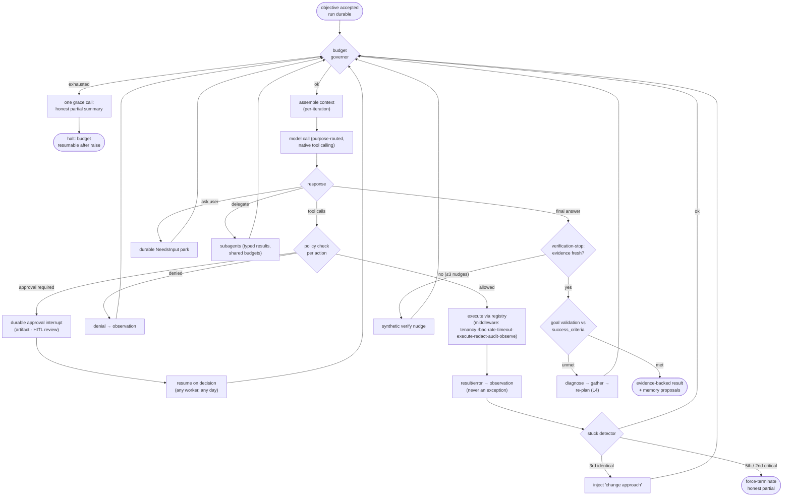
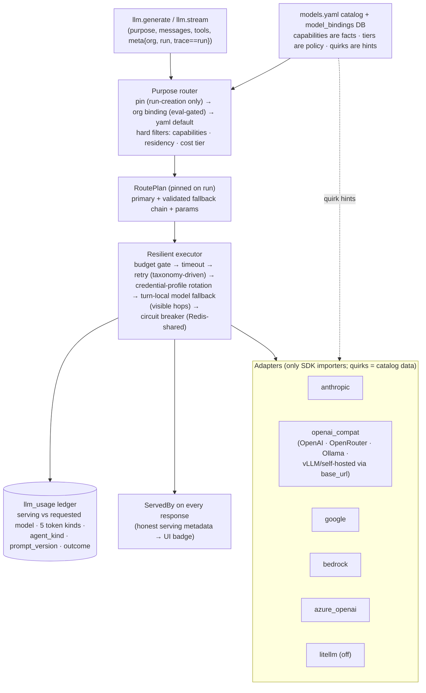
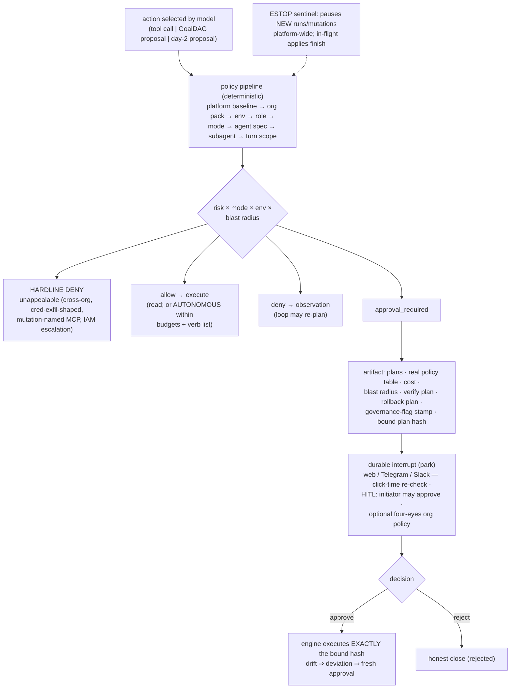
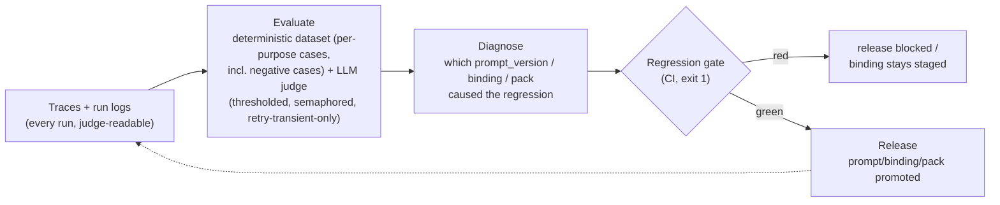

# 04 — Agent Harness Specification

> The kernel that owns generic intelligence. Grounded in source-level study of four reference
> harnesses — Waku (local), Pi (`earendil-works/pi` @ `936aff0`), Hermes
> (`NousResearch/hermes-agent` @ `3f83297`), OpenClaw (`v2026.8.1`) — plus the audited current
> state (01). Contracts here are normative; 05 defines the tool/agent schemas they consume.

---

## 1. What the references teach (and what we refuse)

| Pattern | Source (verified in code) | AegisOps adoption |
|---|---|---|
| Small pure loop + typed hook seams; features live on seams | Pi: 796-line kernel, 9 hooks; Waku: 114-line loop | Kernel stays small; governance mounts as middleware (§3, §6) |
| Failed tool = observation string, never an exception across layers | Waku `registry.py:57-58`; Pi `StreamFn` must-not-throw; Hermes sanitized errors | Loop law L3 (§3) |
| Iteration budget + honest exhaustion message | Waku (10); Hermes (90, refundable, +1 grace call) | Budget governor (§5): iterations + grace summary call |
| Wall-clock budget with compaction grace | OpenClaw `attempt-timeout-prepare.ts` | §5 — never kill a run mid-compaction or mid-apply |
| Stuck/loop detection independent of model judgment | OpenHands stuck rule; OpenClaw tool-loop recovery (2-strike force-terminate) | §3.4 |
| Wire-format adapters (code) × provider configs (data) | Pi: 10 APIs × 40 providers; Hermes ProviderProfile; Waku 2×11 | Provider layer (§4) |
| Two-stage failover: credential rotation before model fallback; fallback turn-local; explicit picks strict | OpenClaw `auth-profiles.ts` | §4.6 |
| Error taxonomy → recovery action (not blind retry) | Hermes `error_classifier.py`; Waku retry-only-that-parameter | §4.6 |
| Approval state in contextvars; security flags frozen at import | Hermes (CVE GHSA-96vc-wcxf-jjff) | §8.6 |
| Approval binds to exact approved args; deny on drift | OpenClaw exec-approvals | §8.4 — already AegisOps' deviation rule; extended to args-hash binding |
| Hardline tier no approval can unlock | Hermes `detect_hardline_command` | §8.2 risk classes |
| Approval hooks are observers only | Hermes plugin contract | §6 hook table |
| Progressive tool disclosure past a context-share threshold | Hermes `tool_search.py` (~10% window) | §4.8 / 05 §4 |
| Verification-before-done nudges (bounded) | Hermes `verification_stop.py` (max 3) | §7.3 |
| Cache-stable prompt prefix vs volatile tail; frozen memory snapshot per session | Hermes `system_prompt.py`, `prompt_caching.py` | 06 §6 context recipes |
| Compaction keeps tool-call/result pairs; recent-tail floor; flush-notes-first | OpenClaw compaction; Pi CompactionEntry with tokensBefore | 06 §7 |
| Run log as source of truth; context/UI are projections | Pi entry tree + lane records; OpenHands event stream | 06 §8 (Task/Run model) |
| Subagents: isolated context, typed size-capped results, untrusted output, no recursion | Hermes contract v1 (16k/32k/32k caps, blocked toolset); OpenClaw yield pattern | §10 |
| Retrieval gate + consolidation with observable decisions | Waku memory | 06 §4 |
| Eval dataset + judge + exit-1 release gate | Waku `release_gate.py` | §9 |
| Provenance-tagged memory; write path is the security boundary | OpenClaw memory-architecture | 06 §2 |

**Refused, with reasons:** monolithic 6k-line loop (unauditable); aux-LLM auto-approval of risky
actions (prompt-injectable; LLMs may only *raise* severity); hot-reload/self-mutating skills in
production paths (ungoverned change vector — Waku, Hermes curator); regex shell-risk analysis as
the primary gate (we gate *typed actions*, not free-form shell); localhost/network-position trust
(OpenClaw CVE-2026-25253); unsandboxed in-process plugins (CVE-2026-25157); quirk sprawl across
dozens of certified models (capability registry + few certified families instead); per-tool agent
swarms; in-product model arena against real clouds.

## 2. Agent model

```python
AgentSpec:
  name: str                        # "main", "investigator", "critic", …
  purpose: str                     # THE ONLY model coupling (router resolves it)
  system_prompt: PromptRef         # versioned registry entry (hash-recorded)
  tool_policy: ToolPolicy          # NONE | READ_ONLY_FROZEN | GOVERNED_PROPOSE   (05 §3)
  budgets: Budgets                 # §5; subagents draw from the parent pool
  context_recipe: str              # 06 §6
  hooks: [HookRef]                 # additional per-spec hooks (platform chain always applies)
```

Agents are declarations. All behavior lives in the kernel. There is deliberately no
`GOVERNED_MUTATION` tool policy: mutation tools exist only inside the engine's executor registry
and are structurally absent from every LLM-facing tool surface. The LLM's strongest verb is
*propose* (`propose_goal_dag`, `propose_day2_action`), and proposals cross the trust boundary as
data (05 §5).

## 3. The intelligent loop

### 3.1 Loop laws (normative)

- **L1 — Policy before action.** Every tool call passes the policy engine (§8) *after* model
  selection of the action and *before* execution. Modes change gate outcomes, never tool schemas.
- **L2 — Budgets inside the loop.** The governor (§5) is checked at every iteration boundary and
  before every provider call and tool call.
- **L3 — Errors are observations.** Tool failure, policy denial, provider fault, verification
  failure — all become typed observation records + observation strings in context. Exceptions
  never cross the kernel boundary.
- **L4 — Re-planning is re-reasoning.** No separate replanner component; the model re-reasons over
  accumulated observations. Deviation *proposals* (for approved plans) are the only structured
  re-plan artifact, and they route through re-approval.
- **L5 — Durable at iteration boundaries.** Each iteration appends to the run log (06 §8);
  a stranded loop resumes from its last boundary on any worker.
- **L6 — Steering at boundaries.** User messages arriving mid-run enter a steering queue, drained
  at iteration boundaries (Pi/OpenClaw); cancel honored at boundaries, never mid-apply.
- **L7 — Ask is a first-class action.** The model may ask the user only what discovery cannot
  answer; an ask parks the run durably (same machinery as approval interrupts).

### 3.2 Iteration structure

```
while True:
    gate = budget_governor.check()                    # L2 → grace-call or halt w/ honest partial
    ctx  = context_engine.assemble(spec, objective,   # per-iteration, 06 §6
                                   run_log.projection())
    resp = llm.stream(purpose=spec.purpose, messages=ctx,
                      tools=registry.schemas_for(spec, turn_filter))   # native FC always
    run_log.append(assistant_turn(resp))              # incl. usage → ledger
    if resp.tool_calls:
        for call in order(resp.tool_calls):           # parallel-safe reads; sequential if any tool demands
            verdict = policy.evaluate(call, principal, mode, risk)     # L1
            if verdict.requires_approval: raise NeedsApproval(artifact)  # durable park
            obs = registry.execute(call)              # middleware chain; errors → obs (L3)
            run_log.append(observation(obs))
        continue                                      # re-reason over observations (L4)
    if wants_ask(resp):        raise NeedsInput(question)              # L7
    if wants_delegate(resp):   results = subagents.spawn(...); continue
    if verification_due(resp): nudge = verify_stop.check(run_log)      # §7.3, max 3
        if nudge: run_log.append(nudge); continue
    return goal_validation(resp, objective.success_criteria)           # §7.4
```

### 3.3 Loop diagram



### 3.4 Stuck & loop recovery

Two independent mechanisms (model-judgment-free): (a) `(tool, args_hash)` repetition — 3rd
identical call injects a "you already ran this — change approach or conclude" observation; 5th
ends the run via the budget path (OpenHands/Brainstorming). (b) Critical-batch intervention — a
tool batch that repeats a failing call pattern triggers one intervention; a second critical batch
force-terminates (OpenClaw). Both emit events and land in the run log.

## 4. Model / provider layer (`app/llm`)

The Brainstorming `Agent_Harness.md` provider design carries over intact (canonical types;
`ProviderAdapter` protocol; adapters as the only SDK importers; quirks as catalog metadata;
streaming event union with authoritative `StreamDone`; never retry a stream after `ToolCallEnd`;
`ThinkingPart` signatures round-tripped by adapters, raw thinking never persisted). This section
fixes deltas and resolves the prior suite's open seams.

### 4.1 Wire families and providers

Six adapter families (code): `anthropic`, `openai_compat`, `google`, `bedrock`, `azure_openai`,
`litellm` (optional escape hatch, off by default). Providers (data rows in `models.yaml`):
Anthropic, OpenAI, **Google Gemini, Azure OpenAI, AWS Bedrock, OpenRouter, Ollama**, plus any
OpenAI-compatible endpoint via `base_url` (vLLM/LM Studio/self-hosted — the mandate's
"OpenAI-compatible + future providers" requirement). Adding a provider is a data row; adding a
wire shape is an adapter (Pi's two-axis rule).

### 4.2 Canonical message roles (resolves I3)

`Role = system | user | assistant | tool`. Tool results are `role="tool"` messages in canonical
form; adapters translate (OpenAI `tool` role; Anthropic `user` + `tool_result` block). The service
facade exposes `generate()` and `stream()` separately; the kernel uses `stream()` for UI-facing
turns and `generate()` elsewhere. No `stream=` parameter exists on `generate()`.

### 4.3 Purposes (task-characteristic routing)

| Purpose | Tier | Needs | Notes |
|---|---|---|---|
| `router` (intent classify) | fast | structured_output | admission-time |
| `extract` (param extraction) | fast | structured_output | |
| `planner` | flagship, reasoning=high | tools_native, structured_output | never silent-fallback |
| `loop.main` | flagship or strong-mid, reasoning=medium | tools_native | the objective loop |
| `inv_loop` / `sre.triage` | mid/fast, reasoning=medium | tools_any | emulation-eligible (§4.5) |
| `critic` | fast | structured_output | advisory pre-compile pass (resolves I4 — *not* `judge`) |
| `retrieval_gate` / `consolidation` | cheapest | — | max_tokens 600 |
| `knowledge` / `general` | fast | streaming | user-pinnable |
| `judge` (offline eval) | flagship | structured_output | never silent-fallback; CI-side |
| `embeddings` | pinned | — | 768-d pgvector pin: rebinding = migration; hot swap refused |

Routing inputs per the mandate: complexity, latency, cost, modality, tool-calling capability,
reasoning capability, context requirements — all encoded as `Needs` matched against catalog
capability facts. **Capabilities are facts, tiers are policy, quirks are adapter hints.**

### 4.4 RoutePlan & bindings

Resolution order (org-scoped, first hit): per-request pin (only user-pinnable purposes; applies at
**run creation only** — resolves I9) → `model_bindings` row (eval-gated: `pending|passed|failed|
waived`) → `models.yaml` default. Hard filters: capability check (config-time
`IncompatibleBinding`), residency, cost-tier ceiling. RoutePlan (primary + validated fallback
chain + params) is pinned on the run row; **every bound purpose must carry ≥1 validated fallback
or an explicit `fallbacks: none` declaration** (resolves I13). Governed purposes (`router`,
`planner`, `loop.main`, `judge`) are never user-pinnable; rebinding them is a change-management
event (RBAC + audit + eval gate).

### 4.5 Capability flags & the emulation tier (resolves I1)

Capability facts include `tools_native`, `tools_emulated`, `structured_output`, `streaming`,
`reasoning`, `vision`, `prompt_cache`. `tools_any = tools_native ∨ tools_emulated`. Emulation
(Hermes-style prompted `<tool_call>` JSON + strict parser + one repair round-trip) is legal **only
for read-effect purposes** (`inv_loop`, `sre.triage`); purposes that produce proposals crossing
the trust boundary require `tools_native` — a guessed parse is not an audit-grade record of
intent. Runtime defense regardless of tier: stray tool-call syntax inside *content* is stripped as
data, never executed (Hermes injection lesson).

### 4.6 Resilience

Taxonomy → action (Hermes discipline): `rate_limited` ≠ `upstream_rate_limited` (aggregator 429 →
switch model, don't rotate key); `context_overflow` → compact and re-ask, never failover; `auth`
vs `auth_permanent` (rotate credential profile vs disable provider); `content_filtered`/`refusal`
surface honestly, no retry. Two-stage failover (OpenClaw): credential-profile rotation within
provider (cooldowns) before model fallback down the RoutePlan chain; fallback is **turn-local**
(session/run keeps its chosen model), every hop recorded in `ServedBy` and emitted as a visible
event; explicit user pins are strict — surface the error, never silently substitute. Retries: max
3, exponential + full jitter, honor `Retry-After`; never retry an arrived-but-unparseable response
(that is a repair round-trip). Circuit breaker per (provider, model) in Redis (shared across
workers). Budget gate before every call. Timeout: 120s default, per-purpose override.

### 4.7 Provider layer diagram



### 4.8 Tool schema pressure

When mounted tool schemas exceed ~10% of the model's context window, non-core tools are deferred
behind `tool_search` / `tool_describe` / `tool_call` bridge tools (Hermes). Core loop tools and
the active pack's primary tools are never deferred. Details in 05 §4.

## 5. Budget governor

```python
Budgets:
  max_iterations: int = 10          # resolves I12 — matches the Waku reference; per-spec override
  max_tool_calls: int = 24          # per run; INV mode inherits the registry's MAX_CALLS=8
  max_cost_usd: Decimal | None      # per run; org daily budget checked alongside
  max_tokens_total: int | None
  wall_clock_s: int = 1800          # with compaction grace + apply grace (never kills either)
  max_mutations: int | None         # risk budget: governed steps per run
  max_subagents: int = 3            # pool shared, depth 1
```

Semantics: breach → **one grace model call** for an honest partial summary (Hermes), then halt at
the next safe boundary — never mid-apply, never mid-compaction (OpenClaw grace). Halt is
`failed(budget)` with a resume-after-raise affordance. All spend (main, subagent, gate, judge,
embeddings) lands in the `llm_usage` ledger with `agent_kind` + `prompt_version` (resolves I11);
tokens are ground truth, dollars derived at read time. Enforcement points: iteration boundary,
pre-provider-call, pre-tool-call, engine step boundary.

## 6. Hooks

One ordered middleware chain, platform hooks first, then pack/spec hooks. **Fail-closed**: a hook
error blocks the gated action (Pi extension rule), is logged, and becomes an observation.

| Hook (mandate) | Seam | Powers |
|---|---|---|
| `before_run` / `after_run` | run lifecycle | admission enrichment, cleanup, notification |
| `before_tool_call` | pre-policy + post-policy | block/rewrite args (platform hooks only), inject context |
| `after_tool_call` | post-execute | result transform/redact before transcript (`tool_result_persist` — OpenClaw) |
| `before_mutation` / `after_mutation` | engine step boundary | final guard re-assert, inventory/world-model update |
| `on_failure` | observation append | classification, incident escalation |
| `on_retry` | executor/engine retry | backoff policy, breaker interaction |
| `before_compaction` / `after_compaction` | context engine | flush-notes-to-memory reminder; audit summary quality |
| `before_approval` / `after_approval` | approval service | **observers only** — hooks may never answer, veto, or pre-fill an approval (Hermes rule); blocking belongs in `before_tool_call` |

Additional platform seams (not user-extensible in v1): `before_prompt_build` (turn-scoped tool
narrowing), `before_agent_reply` (confidentiality withholding), `on_stuck`, `on_budget_breach`.
Hooks are code registered at build time (no runtime-loaded plugin code — OpenClaw CVE lesson);
a sandboxed plugin surface is explicitly deferred (ADR-13).

## 7. Verification

1. **Tool-level:** every ToolDef may declare a `verify` strategy; the middleware can attach
   post-conditions (e.g., a write-shaped day-2 verb always re-reads state).
2. **Step-level (engine):** every mutating step carries a `VerifyPlan` → SDK reads + probes →
   **EvidenceCard** (typed evidence, not a bool). Verify failure ⇒ step is *not done*; one
   re-verify after grace, then deviation or failure.
3. **Loop-level (verification-stop):** the model attempting to finish after mutating actions
   without fresh verification evidence receives a bounded synthetic nudge (max 3) — Hermes
   `verification_stop` pattern, keyed on run-log facts, not model claims.
4. **Goal validation:** the final gate — `objective.success_criteria` evaluated against evidence
   cards and observations; unmet criteria send the loop to diagnose (L4) or produce an honest
   partial. Tool success never implies task success.

## 8. Permissions, policy, approvals

### 8.1 Modes

`READ_ONLY | PLAN_ONLY | APPROVAL_REQUIRED | AUTONOMOUS` — org × environment × risk-class matrix
(03 §6.1; normative semantics in 09 §2). Modes parameterize the policy verdict; tool schemas
never change with mode (L1). PLAN_ONLY runs the identical loop with mutation-bound proposals
clamped at the artifact stage (`plan_ready`) — it is a policy ceiling, not a separate pipeline.
Approval granularity (PER_STEP_HIGH | SINGLE_DAG | PRE_APPROVED) is the orthogonal
`ApprovalPolicy` axis, not a mode.

### 8.2 Risk classes & the hardline tier

Every tool and template carries `risk: read | low | medium | high | destructive`. Deterministic
policy maps (mode, env, risk, blast_radius) → `allow | approval | deny`. **Hardline tier**: a
deny-class no approval can unlock (e.g., cross-org access, credential exfiltration-shaped calls,
mutation-named MCP tools, IAM escalation outside the ◐-gated pack surface) — Hermes'
never-approvable class. LLM outputs may raise assessed risk, never lower it.

### 8.3 Policy evaluation pipeline (per action)

Layered, ordered, allow/deny merge with a non-negotiable platform baseline (OpenClaw pipeline):
`platform baseline → org policy pack → environment → role/sender → mode → agent spec → subagent
restriction → runtime (turn-scoped narrowing)`. Verdicts are logged as observations and audit rows.

### 8.4 Approval mechanics

Durable interrupt (unchanged constitution). The artifact carries: step plans (+a ~c −d), real
policy predicate table (no `_todo` blankets — F-11 closed), cost estimate, blast radius
(`impact_of` on **all** mutations), verification plan, rollback/compensation plan, deviation
policy, change window, **governance-flag stamp** (four-eyes/tenancy/mode/event-bus — D9 made
visible). Approval **binds to the exact compiled plan hash**; any drift at execution time
(precondition change, param revision, world divergence) is a deviation requiring fresh approval —
the existing deviation rule, extended with args-hash binding (OpenClaw deny-on-drift).
Approval is **human-in-the-loop**: the initiating human may review and approve their own plan
(`initiator == approver` is valid). Four-eyes is an optional org-level policy flag (default off);
when an org enables it, it is enforced at the approval core for every interrupting tier.
Click-time identity re-checks on every channel (GW-1, kept) apply regardless.

### 8.5 Permission / approval flow diagram



### 8.6 Implementation hygiene

Approval/mode state lives in request/run-scoped contextvars, never process globals (Hermes CVE);
governance flags are frozen at process start and stamped on artifacts; **ESTOP**: an operator
sentinel that pauses *new* runs and new mutations platform-wide without killing in-flight applies
(Hermes) — the incident brake.

## 9. Evaluation plane



Evaluated dimensions (mandate-complete): task success, tool selection quality, failure recovery
(does a failed observation change the next action?), memory recall, policy adherence (zero
unauthorized mutation attempts), verification honesty, cost, latency, **unnecessary actions**
(actions not on the evidence path — judged). Every verdict records `prompt_version`s and binding
state; the gate blocks provider swaps, prompt changes, and pack changes alike. Offline model
arena (mocked tool layer, judged) feeds binding promotion — never runs against real clouds.

## 10. Subagents

Contract (Hermes v1 + OpenClaw yield, adapted): spawn returns a handle; child runs an `AgentSpec`
with isolated context (subgoal + curated slice, never the parent transcript unless
`context="fork"` is explicitly declared), toolset minus `{delegate, ask_user, memory-write,
channel-send, schedule}`; depth cap 1; read/propose effects only — mutation never delegates.
Results are typed `AgentResult{findings, evidence_refs, confidence, usage}`, size-capped
(goal 16k / context 32k / result 32k chars), and treated as **untrusted evidence** — they can
never override policy or system instructions. Spend draws from the parent budget pool and is
ledgered `agent_kind='subagent'`. Parent consumption is push-based: the child's completion lands
as an event/observation at the next iteration boundary (no polling).

## 11. Kernel size discipline

The loop module (`harness/loop.py`) has a hard review budget: ≤ 500 lines, no SDK imports, no
domain knowledge, no persistence code (delegated to run-log), no policy logic (delegated to
`policy.py`). Anything that grows the loop must instead become a hook, a middleware stage, or a
registry behavior — Pi's rule, kept enforceable by CI line-count + import-linter checks.
