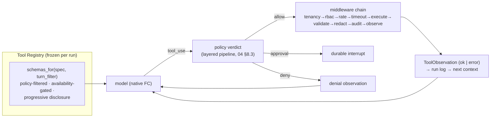

# 05 — Tool and Agent Contracts

> Normative schemas for the surfaces the harness (04) executes and the packs (02 §4) populate.
> Everything here is typed, versioned, and CI-checkable. JSON Schema is the single tool-shape
> dialect (adapters translate per wire family).

---

## 1. ToolDef (the tool registry record)

```python
ToolDef:
  name: str                          # namespaced: "aws.ec2.describe_instances", "github.actions.download_log"
  description: str                   # model-facing; imperative, includes when-NOT-to-use
  input_schema: JSONSchema           # validated before execution; unknown fields rejected
  output_schema: JSONSchema          # validated after execution; result normalized to it
  effect: read | propose             # LLM-facing registry holds ONLY these two (see §2)
  risk: read | low | medium | high | destructive
  side_effects: [str]                # declared, human-readable ("creates ServiceNow ticket")
  providers: [str]                   # which cloud/service backends serve it ("aws", "github", …)
  credentials: CredentialRef         # broker handle — NEVER raw secrets; org-scoped at execution
  timeout_s: int = 30
  retry: RetryPolicy                 # default: no retry for propose; 2× jittered for idempotent reads
  idempotent: bool = True            # reads true; propose true (same draft twice is safe)
  verify: VerifyStrategy | None      # §8 — post-conditions attached by middleware
  rate_key: str | None               # per-org rate bucket
  redact: bool = True                # output passes redaction before transcript/trace
  cost_hint: cheap | normal | expensive   # scheduler + disclosure ordering hint
  requires_capabilities: [str]       # e.g. ["kubeconfig"] — availability gate at schema build (check_fn)
```

Registration-time enforcement (inherits `investigation.py`'s proven bones): mutation-shaped names
rejected in the LLM-facing registry by the 20-marker denylist; the registry **freezes** at run
start — a running agent cannot grow its tool surface; schema build honors `requires_capabilities`
so unavailable tools never appear (no "tool exists but always errors" noise).

## 2. Effect classes vs. tool policies (two taxonomies, resolved)

The prior blueprint conflated these (its inconsistency I2). They are orthogonal:

- **Effect** (property *of a tool*): `read` — observes the world; `propose` — produces data for
  human approval (`propose_goal_dag`, `estimate_cost`, `policy_precheck`, `propose_day2_action`).
  `governed_mutation` is **not an effect in this registry**: mutations exist only as engine
  executor entries (Terraform templates, K8s catalog operations, day-2 verbs) keyed by approved
  plans. No LLM-facing registry ever contains one.
- **ToolPolicy** (property *of an agent spec*): `NONE` (router/critic/judge — no tools),
  `READ_ONLY_FROZEN` (investigator, SRE triage — read-effect only, frozen registry, shared call
  budget), `GOVERNED_PROPOSE` (main loop, planner — read + propose effects).

## 3. Execution middleware (order is normative)

```
tenancy_scope → rbac_check → policy_verdict → rate_limit → timeout → execute
             → output_validate → redact → audit → observe(emit)
```

- Failure at any stage returns an **observation** (`ToolObservation{ok=False, stage, error}`),
  never an exception (L3). The audit stage writes the `audit_log` row for every call — closing
  the two-call-site audit gap found in the current system.
- Cancellation: cooperative; checked before execute and honored between tool calls. A tool
  exceeding `timeout_s` is cancelled and reported as a timeout observation.
- Rate limits are Redis-backed per `rate_key` × org (replaces the per-process slowapi store, F-17).



## 4. Discovery, filtering, disclosure

1. **Static:** `schemas_for(spec)` = registry ∩ spec.tool_policy ∩ pack activation ∩ availability.
2. **Turn-scoped narrowing:** the `before_prompt_build` seam may narrow further (e.g., during
   parameter collection only `extract`-relevant tools are mounted).
3. **Progressive disclosure:** when mounted schemas would exceed ~10% of the bound model's context
   window, non-core tools are replaced by three bridges — `tool_search(query)`,
   `tool_describe(name)`, `tool_call(name, args)` — with core loop tools and the active pack's
   primary tools never deferred (Hermes). Bridge calls pass the identical policy/middleware path.
4. **MCP:** external MCP servers mount as `read`-effect tools only, behind an org-admin allowlist;
   mutation-shaped names refused at registration; MCP results are untrusted input (redaction +
   injection-stripping on ingest).

## 5. Trust-boundary payloads (propose-effect outputs)

```python
GoalDAGDraft:                        # the ONLY way infrastructure change is initiated
  objective_id: str
  steps: [StepDraft{ id, kind: module|day2|k8s, template_key,   # must exist in approved catalog
                     params, wires, depends_on, rationale }]
  on_failure: halt | rollback | continue_independent
  window: ChangeWindow | None
# → engine.compile_goal_dag(draft) → Workflow | RefusalReport (catalog/wiring/guard/
#   compensation/lock closures — 07 P3.1). Refusals are observations; the loop may revise (L4).

Day2Proposal:
  verb_key: str                      # must exist in DAY2_ACTIONS registry
  target: ResourceRef
  rationale: str
  evidence_refs: [EvidenceRef]       # remediation must cite evidence
```

The compiled plan hash is what approval binds to (04 §8.4). Post-approval, the engine executes
deterministically; divergence ⇒ deviation ⇒ re-approval.

## 6. Agent contracts

```python
AgentSpec        # 04 §2 — declaration only
AgentResult:                          # subagent → parent; size caps enforced
  status: answered | budget | failed | needs_input
  findings: str                       # ≤ 32k chars
  evidence_refs: [EvidenceRef]        # pointers into the child's run log — never raw transcripts
  confidence: low | medium | high
  usage: Usage                        # rolls up into parent ledger, agent_kind='subagent'
SpawnRequest:
  spec: AgentSpecRef; subgoal: str (≤16k); context_slice: CuratedSlice (≤32k)
  # blocked in child: delegate, ask_user, memory-write, channel-send, schedule
  # child output is UNTRUSTED EVIDENCE — cannot override policy/system instructions
```

## 7. Policy contract

```python
PolicyRequest:  {principal, org, env, mode, action: ToolCall|StepRef, risk, blast_radius?}
PolicyVerdict:
  decision: allow | approval_required | deny | hardline_deny
  reasons: [str]                      # every verdict explainable; logged + auditable
  approval_tier: SINGLE_DAG | PER_STEP_HIGH | PRE_APPROVED | None
  bound_hash: str | None              # what an approval, if granted, binds to
```

Deterministic; pure function of (request, org policy pack, platform baseline). LLM risk
assessments may appear in `reasons` and may raise `risk`, never lower a decision's severity.
`hardline_deny` is unappealable by construction (04 §8.2).

## 8. Verification contracts

```python
VerifyStrategy:                       # declared per tool/template/day-2 verb
  checks: [Check]                     # SDK reads, HTTP/TCP probes, PromQL assertions, rollout status
  timeout_s: int; grace_s: int        # one re-verify after grace before failure
EvidenceCard:                         # what verify PRODUCES — never a bool
  subject: ResourceRef | ServiceRef
  checks: [{check, expected, observed, ok, at, source_tool}]
  verdict: verified | failed | partially_verified | unverifiable   # honest states
  collected_by: str                   # tool/executor identity — independent of the actor that mutated
Check evaluation rule: evidence is collected by READ tools independent of the mutation path;
"unverifiable" is an honest first-class outcome (no fake passes — Neo4j-down lesson).
```

## 9. Prompt registry

`PromptRef(name, version)` → registry table row: content, content_hash, owner, changelog,
eval_state. Recorded on every ledger row (`prompt_version`) and Langfuse generation. Prompts
change only via PR + eval gate — they are versioned artifacts, not string literals (closes
"which prompt caused this regression?").

## 10. Capability-pack registration contract

A pack module exports exactly: `TOOLS: [ToolDef]`, `KNOWLEDGE: [PromptFragment]`,
`PLAYBOOKS: [ProcedureRef]`, `VERIFY: {resource_type: VerifyStrategy}`, `TEMPLATES: [TemplateKey]`,
`DAY2: [Day2VerbKey]`, `POLICIES: [PolicyFragment]`. CI enforces: no loop code, no SDK dispatch
outside ToolDef `fn`s, no imports from `harness` internals beyond the public contract, parity
manifests per service family (03 §3.4). A pack is reviewable data; the kernel is the only engine.

## 11. Canonical model-invocation contracts (P1.1 — resolves C-01)

> Added at the P1 entry gate (2026-08-10). 04 §4 defines the provider layer's semantics
> (purposes, `RoutePlan`, capability flags, `ServedBy`, error taxonomy) but delegated the
> canonical wire types to an external document; these are the normative minimum shapes.
> Owner at P1.1: `app/llm/types.py`. Consumers: adapters (`app/llm/adapters/*`), `service.py`,
> the ledger, and (from P2) the harness kernel. Evolution: additive-only — there is no
> per-contract wire-version field yet (C-03 stands); renames/retypes are breaking changes
> and forbidden without a versioning decision.

- **`CanonicalMessage`** — `role: system|user|assistant|tool` (04 §4.2) · `content: str` ·
  `tool_calls: [ToolCall] | None` (assistant only) · `tool_call_id: str | None` (tool role only).
- **`ModelRequest`** — `purpose: Purpose` (04 §4.3 enum; the ONLY model coupling) ·
  `messages: [CanonicalMessage]` · `tools: [ToolDef] | None` (§1; adapters translate per wire
  family) · `params: {temperature?, top_p?, max_tokens?, timeout_s (default 120), stop?}` ·
  `route: RoutePlan` (resolved before dispatch; pinned on the run row) · `metadata: {run_id?,
  org_id?, agent_kind, prompt_ref: PromptRef | None}`. `generate()` and `stream()` take the
  same request; there is no `stream=` flag (04 §4.1).
- **`ModelResponse`** — `content: str` · `tool_calls: [ToolCall]` (empty when none) ·
  `finish_reason: stop|length|tool_calls|content_filter` · `usage: Usage` ·
  `served_by: ServedBy` · `latency_ms: int`.
- **`Usage`** — `input_tokens · output_tokens · total_tokens · cache_read_tokens? ·
  cache_write_tokens?` (the five token kinds of 04 §4.7); rolls into `llm_usage` verbatim.
- **`ServedBy`** — `provider · model · requested_model · fallback_hop: int` (04 §4.6; honest
  serving metadata on every response, rendered as badges per 10-V).
- **`StreamEvent`** — `kind: text_delta | tool_call_delta | usage | served_by | error | done` ·
  `payload` (kind-shaped). Every stream terminates with exactly one `done` (after `usage` +
  `served_by`) or exactly one `error` carrying a `ModelError`.
- **`ToolCall`** — `id: str` (provider-issued or synthesized) · `name: str` (registry-namespaced,
  §1) · `arguments: dict` (validated against the ToolDef `input_schema` BEFORE policy/dispatch) ·
  `args_hash: str` (canonical-JSON SHA-256 — the identity used by policy binding, idempotency and
  IP-1's repetition detector).
- **`ToolResult`** — `tool_call_id: str` · `ok: bool` · `content: str | dict` (schema-validated
  on ok) · `error: {kind, message} | None` · `stage: str` (which middleware stage failed, §3).
  A `ToolResult` is what re-enters the model as the tool-role message; middleware wraps it into
  the run-log `ToolObservation` (§3) — same data, two audiences.
- **`ModelError`** — `kind: rate_limited | upstream_rate_limited | context_overflow | auth |
  auth_permanent | content_filtered | refusal | timeout | unavailable | invalid_request` (04 §4
  taxonomy) · `retriable: bool` · `provider_detail: str` (redacted). `context_overflow` triggers
  compact-and-retry, never failover (06 §7); `auth_permanent` opens the breaker for the binding.
