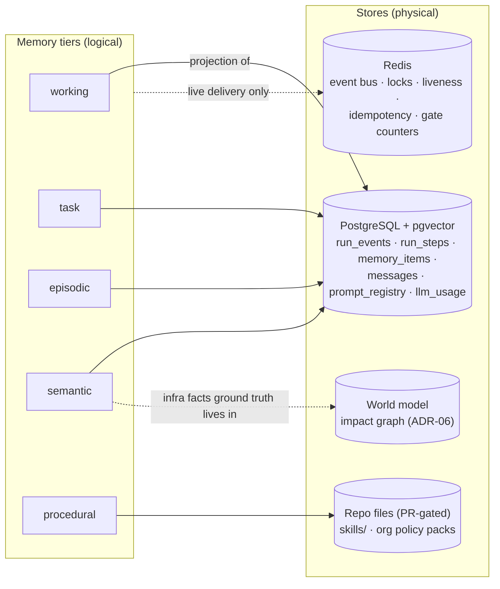

# 06 — Memory, Context, and Execution

> Three interlocking subsystems: purposeful memory (what the platform knows), the context engine
> (what a given model call sees), and the durable Task/Run system (what actually happened and how
> it survives restarts). The run log is the source of truth; context and UI are projections.

---

## 1. Memory tiers

| Tier | Content | Scope | Store | Written by | Lifecycle |
|---|---|---|---|---|---|
| **Working** | current iteration's assembled context | run | in-memory (projection of run log) | context engine | discarded per iteration; recoverable by replay |
| **Task** | objective, plan, observations, evidence for one run | run | `run_events` + `run_steps` (PG) | kernel/engine | retained per retention policy; immutable |
| **Episodic** | distilled "what happened" per run/incident (one-paragraph episodes, postmortem drafts) | org | `memory_items(kind='episode')` + pgvector | consolidation (proposal→accept) | searchable; expires per policy (default 400d) |
| **Semantic** | durable facts: "org's usual region is ap-south-1", "service X flaps on deploy", infra context | org / user | `memory_items(kind='fact')` + pgvector | consolidation **proposals**, human accept; human direct | lives until contradicted/expired; versioned |
| **Procedural** | diagnosis playbooks, operational procedures (SKILL.md-format) | platform / org | versioned files in repo + registry table | **humans via PR + eval gate only** | released like code |

Plus standing **org policy packs** (constraints injected into planning — AGENTS.md/rules-file
pattern) and the **infrastructure context** (inventory + world model), which is not "memory" but
ground truth maintained by the engine.

Every `memory_items` row carries the mandate's required attributes:

```sql
CREATE TABLE memory_items (
  id BIGSERIAL PRIMARY KEY,
  org_id UUID NOT NULL, user_id UUID NULL,          -- scope
  kind TEXT NOT NULL CHECK (kind IN ('fact','episode')),
  subject TEXT NOT NULL, content TEXT NOT NULL,
  embedding VECTOR(768),
  provenance TEXT NOT NULL CHECK (provenance IN ('human','consolidation_accepted','system')),
  origin_run_id UUID NULL,                          -- provenance chain
  confidence REAL NOT NULL DEFAULT 0.7,             -- decays without re-confirmation
  importance REAL NOT NULL DEFAULT 0.5,             -- retrieval ranking weight
  status TEXT NOT NULL DEFAULT 'active'             -- active | superseded | expired | retracted
      CHECK (status IN ('active','superseded','expired','retracted')),
  supersedes BIGINT NULL REFERENCES memory_items(id),
  expires_at TIMESTAMPTZ NULL,
  created_at TIMESTAMPTZ NOT NULL DEFAULT now(), created_by TEXT NOT NULL
);
```

## 2. Write-path security (the OpenClaw lesson, kept strict)

The write path is the security boundary. **No agent ever writes semantic/procedural memory
directly.** Consolidation produces *proposals* (notification-accept flow, as drift findings do
today); a human accepts them into `memory_items`. Provenance is a column the model cannot set
through prose; retrieval templates render provenance so downstream reasoning can weigh it.
Contradiction handling: an accepted fact that conflicts with an active fact **supersedes** it
(link preserved) rather than coexisting or silently overwriting — closing the gap both Waku and
current AegisOps have. Memory failures never block a reply (timeout + fail-open to less context).

## 3. Procedural memory (skills), governed

SKILL.md format with YAML frontmatter (name, description, triggers, applicability) — adopted from
the Hermes/agentskills convention because it works; **hot reload and agent self-authoring are
refused** in production paths. Skills enter via PR + review + eval gate; the agent may *draft* a
skill from a run (`skill_workshop`-style propose flow) but a human merges it. Loading is
match-gated (keyword/embedding overlap, max 2 per turn) with frontmatter always cheap-scanned —
progressive disclosure, not context flooding.

## 4. Retrieval gate & consolidation

- **Gate** (Waku, adapted): one cheapest-tier call decides retrieve/skip + query rewrite; **fails
  open**; deterministic always-retrieve overrides (explicit positional recall; in-flight parameter
  collection). Decision emitted as an observable event + counted (skip-rate on dashboards).
- **Consolidation:** after run completion (and every N exchanges for chat sessions), a
  cheapest-tier pass distills candidate facts + one episode from the run log; each candidate
  becomes a **proposal** with provenance and the evidence refs that support it. Parse/API failure
  loses nothing (rows stay unconsolidated). Operational lessons ("GKE quota exhausted in
  asia-south1 twice this month") flow through the same path.
- **Retrieval policy per tier:** working = always (it *is* the context); task = current run always;
  episodic/semantic = gated top-k (k=3-4) ranked by cosine × importance × recency × confidence;
  procedural = match-gated (§3). Retrieval quality is measured (eval dimension: memory recall).

## 5. Storage mapping (tiers ≠ stores — diagram fixes G5)



Redis is delivery/coordination, never a system of record (integrity rule from the failure matrix).

## 6. Context engine

Per-iteration assembly (cadence fix — today it runs once per node) from a fixed, readable recipe:

```
1. cache-stable prefix:  system prompt (versioned) · agent identity+model ·
                         org policy pack · active pack knowledge          [stable per run]
2. semi-stable:          objective + success criteria · plan state ·
                         memory snapshot (frozen at run start; mid-run
                         accepts land next run — cache economics)         [stable per phase]
3. volatile tail:        task memory projection (recent verbatim 70% /
                         older-digest 30% — keep the existing budgeter) ·
                         gated retrievals · matched skills · last observations
```

Per-purpose character budgets survive (router 1.6k … general 8k, tuned). Tool activity is folded
into history entries as compact `[tools used: …]` lines (Waku's duplicate-action fix). Plans are
referenced by summary line and fetched on demand (existing context offloading, kept).

## 7. Compaction

Trigger: projected tokens > bound model's context window − reserve (per-model from the catalog);
also on provider `context_overflow` (compact-and-retry, never failover). Mechanics (OpenClaw/Pi):
`before_compaction` hook reminds the model to flush durable notes to memory proposals; summary is
structured (goals/decisions/learnings/pending, exact resource ids preserved); tool-call/result
pairs never split at the boundary; recent tail floor (default 20k tokens) + minimum prompt budget
floor; the compaction record lands in the run log with `tokens_before/after` (auditable). Wall-
clock budget extends during compaction (never kill mid-summarize).

## 8. The durable Task/Run system

### 8.1 Entities

```
Task        — user-visible objective container (may span runs: retries, scheduled, follow-ups)
Run         — one execution attempt: pinned RoutePlan, budgets, mode, status machine
Step        — engine-governed unit (module|day2|k8s|read|gate) with wave, idempotency key
Plan        — compiled Workflow artifact (hash-bound to approval)
ToolCall    — every LLM-selected action w/ args hash, policy verdict, timing
Observation — every result/error/denial/steering message (typed)
Approval    — immutable decision record (kept from today)
Verification— EvidenceCard set + goal-validation outcome
```

### 8.2 The run log (event-sourced, the source of truth)

```sql
CREATE TABLE run_events (
  id BIGSERIAL PRIMARY KEY,
  run_id UUID NOT NULL, org_id UUID NOT NULL,
  seq INT NOT NULL,                                  -- per-run monotonic; UNIQUE(run_id, seq)
  kind TEXT NOT NULL,   -- iteration_started | assistant_turn | tool_call | observation |
                        -- policy_verdict | approval_requested | approval_resolved |
                        -- step_started | step_finished | deviation | verification |
                        -- compaction | steering | budget | subagent_spawned | subagent_result |
                        -- run_finished
  payload JSONB NOT NULL,                            -- redacted at write
  at TIMESTAMPTZ NOT NULL DEFAULT now()
);
```

Rules: append-only; redaction before write; replay(run_id) reconstructs loop state at any
boundary (resume = replay + continue — Pi's lane records); the Redis stream is the *live* feed,
`run_events` the durable record; UI tabs and Langfuse are projections. `run_steps` remains the
step-level read model (existing table, gains `wave`, `evidence JSONB`, `compensation_of`).

Supporting DDL (resolves prior-suite gap I11): `llm_usage` (as specified in the Brainstorming
provider layer, **plus `prompt_version TEXT`**, month-partitioned); `prompt_registry(name,
version, content, content_hash, owner, changelog, eval_state, created_at — PK(name,version))`;
`model_bindings` (as specified: PK(org_id,purpose), eval_state, updated_by/reason).

### 8.3 Run status machine (replaces the phantom `applying`)

```mermaid
stateDiagram-v2
    [*] --> running
    running --> awaiting_approval : NeedsApproval
    running --> awaiting_input : NeedsInput (ask)
    awaiting_approval --> scheduled : approved, outside change window
    awaiting_approval --> executing : approved
    awaiting_approval --> completed : rejected → honest close
    awaiting_input --> running : answer received
    scheduled --> executing : window opens (reconciler launches; stale approval re-validated)
    executing --> verifying : steps done
    executing --> awaiting_approval : deviation
    verifying --> completed : goal validated
    verifying --> executing : re-plan (bounded)
    running --> failed : budget | error (honest partial)
    executing --> rolled_back : on_failure=rollback (saga)
    running --> cancelled : boundary cancel
    executing --> cancelled : boundary cancel (never mid-apply)
```

Every literal written by exactly one owner; `verifying`, `scheduled`, `rolled_back`,
`awaiting_input` are new; `applying` dies (D5).

### 8.4 Background & resumable execution

- **Process split:** API workers (stateless, serve HTTP/SSE) + a **worker role** that owns loop
  execution, engine steps, reconciler, retention, consolidation — ending the
  every-replica-runs-every-sweeper duplication (F-18). Same image, role by env flag; the Executor
  protocol is the later seam for a dedicated heavy pool.
- **Liveness & recovery (kept):** heartbeat TTL 45s/15s; reconciler 60s sweep resumes stranded
  runs from the last durable boundary (checkpoint/run-log replay) on any worker, or fails them
  honestly; approval waits are indefinite and never swept.
- **Long waits:** approval/ask = durable parks; long polls (RDS ~10min, GKE ~15min) are
  supervisor-tracked heartbeated tasks; a heartbeat-dead poll is treated as stranded.
- **Steering & cancellation:** steering queue consumed at iteration boundaries; cancel at
  boundaries only; a running `terraform apply` always completes or fails on its own terms.
- **Scheduled work:** change-window parks (`scheduled`) re-validate preconditions at launch; an
  approval older than policy max (default 24h) re-verifies world state — drift ⇒ deviation.
  "An old approval is not a blank check."
