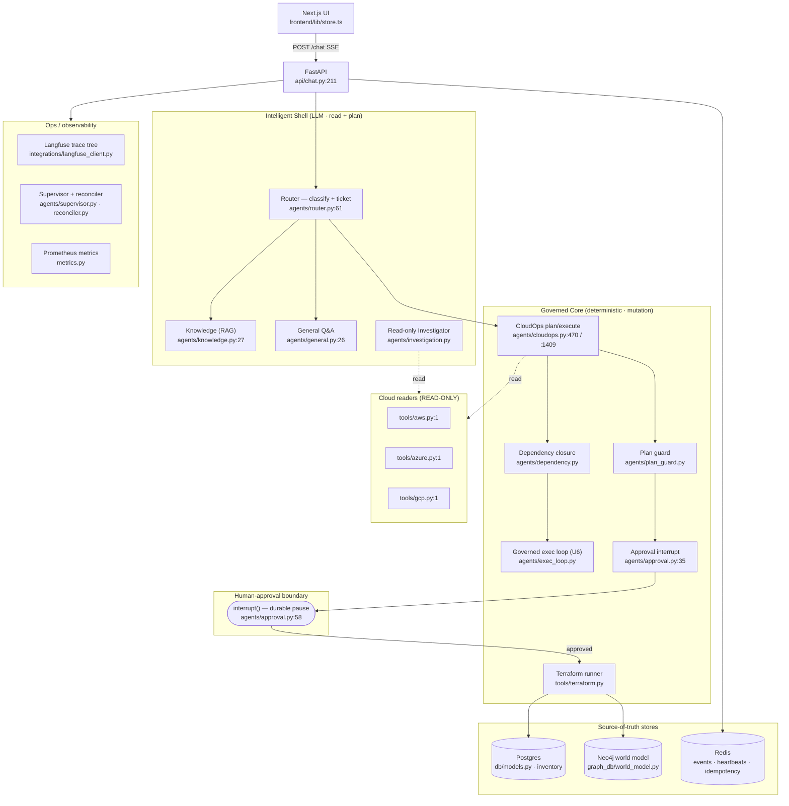

# 00 · Architecture Map

Split-trust architecture: an **Intelligent Shell** (LLM plans, investigates, and answers with
full read autonomy) around a **Governed Core** (deterministic code is the only thing that
mutates infrastructure, and only after a human approval interrupt). Every box below names the
file that implements it.

## The whiteboard — box → file

## Container / infra topology (`docker-compose.yml`)

Eleven services. Ports are `host:container`.

| Service | Image | Host port | Role |
|---|---|---|---|
| `api` | `aegisops-api:local` (`docker-compose.yml:183`) | 8000 (`:212`) | FastAPI app (`app/main.py`) |
| `frontend` | `aegisops-frontend:local` (`:231`) | 3000 (`:240`) | Next.js UI |
| `postgres` | `pgvector/pgvector:pg16` (`:18`) | `${POSTGRES_PORT:-5432}`→5432 (`:25`) | relational + pgvector embeddings + LangGraph checkpoints |
| `redis` | `redis:7.4-alpine` (`:38`) | 6379 (`:42`) | event bus, heartbeats, idempotency, param-collection, cancel flags |
| `neo4j` | `neo4j:5.26` (`:52`) | 7474, 7687 (`:60`) | world model (Resource nodes + DEPENDS_ON edges) |
| `keycloak` | `quay.io/keycloak/keycloak:25.0` (`:72`) | 8080, 9000 (`:82`) | OIDC + RBAC realm |
| `langfuse` | `langfuse/langfuse:2` (`:97`) | 3001→3000 (`:122`) | trace/span/generation UI |
| `otel-collector` | `otel/opentelemetry-collector-contrib:0.115.1` (`:133`) | 4317/4318/8889 (`:139-142`) | OTLP spans + metric forwarding |
| `prometheus` | `prom/prometheus:v2.55.1` (`:146`) | 9090 (`:157`) | metric scrape + alert rules |
| `grafana` | `grafana/grafana:11.4.0` (`:163`) | 3002→3000 (`:176`) | dashboards |

Named volumes (`docker-compose.yml:245-252`): `pgdata`, `redisdata`, `neo4jdata`, `neo4jlogs`,
`promdata`, `grafanadata`, `tfstate`, `tfplugins`. The dev/prod override
(`docker-compose.override.yml`) adds `api-b` (a second stateless API worker, profile `full`),
`api-test` (profile `test`, its own `tfplugins-test` volume — STAB P0-1), and the `/secrets`
credential mount.

**Terraform state isolation.** `.terraform` lives on the native `tfstate` volume, not the
workspaces bind mount, via `TF_DATA_ROOT` (`settings.py:184`, `tools/terraform.py:_data_dir`);
the provider plugin cache is the shared `tfplugins` volume via `TF_PLUGIN_CACHE_DIR`
(`settings.py:177`).

## Feature flags (`settings.py`) — what each gates

| Setting | Default | Gates |
|---|---|---|
| `aegisops_tenancy` (`:32`) | `strict` | strict → every request scoped to the principal's org (`security/deps.py:90`); `legacy` → shared workspace |
| `aegisops_event_bus` (`:36`) | `memory` | `redis` → cross-worker SSE via Redis Streams (`agents/events.py:RedisChannel`) |
| `aegisops_reconciler` (`:40`) | `on` | starts the stranded-run reconciler loop at startup (`main.py:75`) |
| `aegisops_drift` (`:44`) | `off` | drift/orphan sweeps + `DRIFT_FINDINGS` gauge (`reconciler.py:223`) |
| `aegisops_exec_loop` (`:47`) | `off` | multi-step create-first DAG runs via the governed loop vs. proposed as text (`cloudops.py`, `exec_loop.py`) |
| `aegisops_tf_backend` (`:133`) | `local` | `remote` → S3+DynamoDB backend config (`tools/terraform.py:_backend_config_args`) |
| `aegisops_tf_skip_init_when_ready` (`:176`) | `True` | warm-init skip (`tools/terraform.py:_is_initialized`) |
| `reveal_stepup_max_age_seconds` (`:52`) | `120` | credential-reveal step-up re-auth freshness (`security/deps.py:verify_stepup_auth`) |
| `max_active_runs_per_org` / `_per_user` (`:193-194`) | 5 / 2 | active-run admission (`api/chat.py:_active_run_counts`) |
| `default_execution_mode` (`:187`) | `plan` | the run's mode on creation (`api/chat.py:260`) |
| `retention_*_days` (`:197-199`) | 0 (off) | retention sweeps (`agents/retention.py`) |

## App wiring at startup (`app/main.py`)

`lifespan` (`main.py:42-101`) initializes, in order: logging → OTel (`:45`) → Postgres engine
(`:46`) → Redis (`:47`) → Neo4j (`:48`) → world-model schema (`:52`, best-effort) → LangGraph
checkpointer + compiled graph (`:60-61`) → Langfuse project assertion (`:66`) → promoted-module
rehydrate (`:69`) → reconciler (`:78`, if `aegisops_reconciler == "on"`). Shutdown drains
in-flight runs then closes stores (`:87-101`). Routers mounted at `main.py:162-169`: health,
auth, integrations, chat, sessions, artifacts, modules, knowledge. Middleware: correlation-id +
per-request metrics (`main.py:104-129`), CORS, SlowAPI rate limiting (`main.py:144-153`).

The split-trust boundary is not a suggestion — it is the graph's topology. See
[02_langgraph.md](02_langgraph.md) for how `approval → execute` is the only edge into mutation,
and [01_request_lifecycle.md](01_request_lifecycle.md) for the full request journey.
