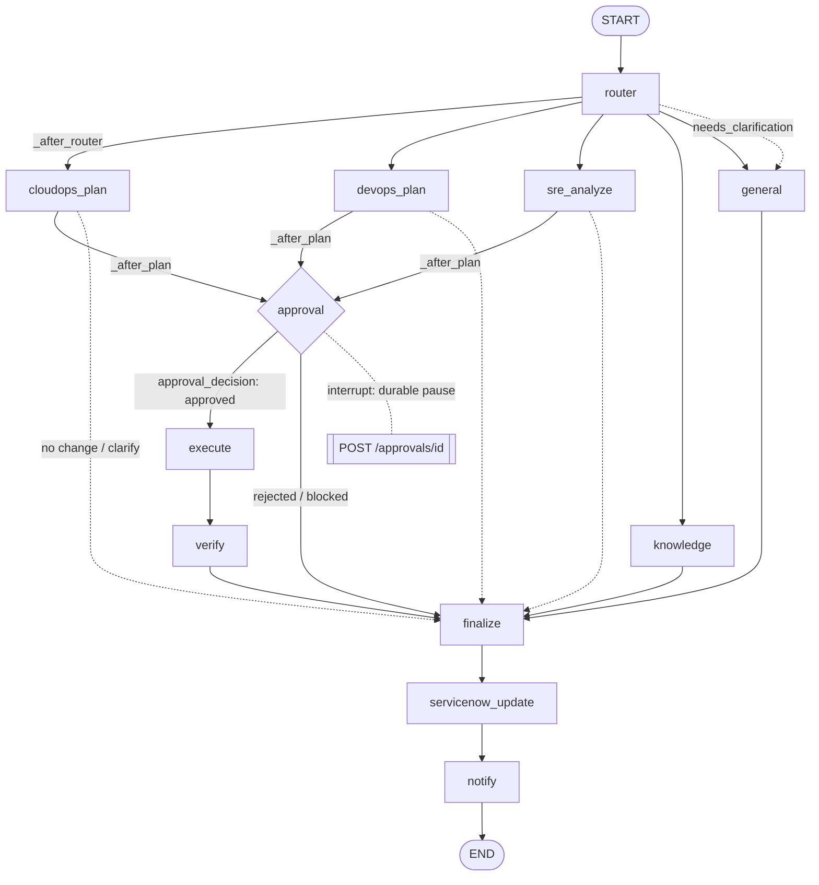

# 02 · The LangGraph Graph

The multi-agent graph is assembled in `agents/graph.py:build_graph` (`:80`) and compiled with a
durable Postgres checkpointer. Shared state is `AgentState` (`agents/state.py:10`, a
`TypedDict(total=False)`). One trace per run id spans the whole thing, including the resume.

## The graph



Edges are wired at `graph.py:96-108`. The two conditional routers:

- **`_after_router`** (`graph.py:58`): `needs_clarification` → `general`; else map `domain` →
  its plan/leaf node (`cloudops→cloudops_plan`, `devops→devops_plan`, `sre→sre_analyze`,
  `knowledge`, `general`), default `general`.
- **`_after_plan`** (`graph.py:70`): `needs_clarification` → `general`; `needs_change and
  approval_status=="pending"` → `approval`; else → `finalize`.
- **`approval_decision`** (`approval.py:95`): `"execute"` iff `approval_status=="approved"`,
  else `"finalize"`. **This is the only edge into mutation.**

## Nodes — what each reads and writes on state

| Node | File | Reads (state) | Writes (state) |
|---|---|---|---|
| `router` | `router.py:61` | `message`, `session_id`, pending-params | `domain`, `intent`, `intent_confidence`, `routing_reason`, `cloud`, `resource`, `action`, `target`, `snow_id`, `needs_clarification` |
| `cloudops_plan` | `cloudops.py:470` | `action`, `target`, `cloud`, `resource`, `message`, `org_id`, `parsed_inputs` | `needs_change`, `approval_status`, `interrupt_payload`, `plan_json`, `diff`, `policy_checks`, `state_workspace`, `parsed_inputs`, `workflow`, `goal_dag`, `answer`, `collecting`, `needs_clarification` |
| `devops_plan` | `devops.py:67` | `message` | `needs_change`, `approval_status`, `interrupt_payload` |
| `sre_analyze` | `sre.py:97` | `message` | `needs_change`, `approval_status`, `interrupt_payload`, `answer` (decision) |
| `knowledge` | `knowledge.py:27` | `message`, `org_id`, `session_id` | `answer`, `references`, `confidentiality` |
| `general` | `general.py:26` | `message`, `session_id`, `needs_clarification`, `llm_unavailable` | `answer`, `confidentiality` |
| `approval` | `approval.py:35` | `needs_change`, `approval_status`, `diff`, `action`, `interrupt_payload` | `approval_status`, `approver` |
| `execute` | `execute.py:16` | `approval_status`, `approver`, `domain`, `workflow`, `goal_dag` | `outcome`, `tool_results`, `answer` |
| `verify` | `finalize.py:64` | `outcome`, `cloud`, `parsed_inputs` | `tool_results`, `outcome` (adds `connection`), `answer` (success card) |
| `finalize` | `finalize.py:108` | `approval_status`, `outcome`, `answer`, `needs_change` | `resolution`, `outcome.resolution` |
| `servicenow_update` | `servicenow_agent.py` | `snow_id`, `outcome` | ServiceNow work-note (best-effort) |
| `notify` | `notify.py` | `user`, `approver`, `outcome` | notification/email (best-effort) |

`AgentState` channels are declared at `state.py:10-75`; `messages` uses LangGraph's `add_messages`
reducer (`state.py:21`).

## The timing wrapper

Most nodes are wrapped by `_timed(name, fn)` (`graph.py:36`) which brackets the node in
`timing.start_step` / `timing.end_step` (writing a `run_steps` row, driving a Langfuse span, and
observing `AGENT_STEP_DURATION`). Two nodes are **not** wrapped (`graph.py:84,89`):
`cloudops_plan` records its own finer sub-steps (`cloudops_agent`, `policy_evaluation`,
`planner`), and `approval` self-times **across** the human interrupt so the recorded duration is
the real human-wait. See [03_harness.md](03_harness.md) §Tracing.

## The approval interrupt / resume mechanics

The heart of the split-trust boundary. `approval` (`approval.py:35`):

1. If nothing needs changing, returns `approval_status="not_required"` (`approval.py:37-38`).
2. **A2 re-assert:** `plan_guard.check_plan_actions(_guard_action(state), diff)`
   (`approval.py:44`) — a plan whose actions don't match the operation (an apply that would
   delete/replace, a destroy that would create) is blocked **before** the interrupt, never shown
   to an approver (`approval.py:45-51`).
3. Opens the approval timing span (`approval.py:56`), then **pauses the graph**:
   `decision = interrupt(payload)` (`approval.py:58`). LangGraph writes a durable checkpoint and
   `graph.ainvoke` returns; `runner.py:66-67` detects the pause via `snapshot.next` and reports
   `interrupted=True`. The API persists the run `awaiting_approval` (`chat.py:296`) and the SSE
   stream ends at the `interrupt` frame.
4. **Resume:** `POST /approvals/{run_id}` (`chat.py:349`, `resolve_approval`) re-drives the graph
   with `Command(resume=resume_value)` (`runner.py:63`). LangGraph re-enters `approval` at the
   `interrupt(...)` call, which now returns the resume value — the decision dict
   (`approval.py:61-65`). The node records the immutable `Approval` row (`approval.py:74`) + the
   context-graph approval, then `approval_decision` routes to `execute` or `finalize`.

```mermaid
sequenceDiagram
    participant G as graph.ainvoke (run 1)
    participant CK as Postgres checkpointer
    participant API as /approvals resume
    participant G2 as graph.ainvoke (Command resume)
    G->>CK: interrupt(payload) → durable checkpoint at approval
    Note over G: ainvoke returns; snapshot.next non-empty → interrupted
    API->>CK: reads thread_id = run_id
    API->>G2: ainvoke(Command(resume={decision,user,role,can_execute,email}))
    G2->>G2: interrupt() returns the resume value; record Approval row
    G2->>G2: approval_decision → execute (if approved)
```

**Durable across restart.** The checkpointer is a Postgres `AsyncPostgresSaver` keyed by
`thread_id == run_id` (`checkpointer.py:26-39`, `runner.py:40`). Because state is persisted per
run id, a run paused at the interrupt survives an API restart — a later `/approvals` (or the
reconciler) resumes it from the exact checkpoint (`checkpointer.py:4`).

**Resume payload carries capability.** `resolve_approval` builds the resume dict with the
approver's `can_execute` (`chat.py:395` area) so the execute node's S5 assertion
(`execute.py:23`) can fail closed if the recorded approver lacks execute capability.

**Continuation stream (P0-3).** The resume drive tails the run's channel from
`current_cursor()` captured before the drive (`chat.py`, `events.py:current_cursor`) so, on the
Redis bus, the continuation isn't stopped by the original turn's end-of-stream marker — the
apply progress and `done` actually reach the browser.

## Terminal-state guarantees (B5)

- Graph failure → `runner.py:88-92` returns `{"error": ...}`, `_drive` persists `failed`
  (`chat.py:296,301-305`).
- Any `_drive` exception → `_force_terminal(run_id, ...)` (`chat.py:322-324`).
- Interrupt → persisted `awaiting_approval` (a legitimate non-terminal wait; the reconciler
  leaves it alone).
- Worker death → reconciler stranded-run sweep re-drives (if resumable) or force-fails
  (`reconciler.py`), and the `_redrive` persists the result so a re-driven run doesn't get
  force-failed on the next sweep.
- `cancelled` is a first-class terminal status (PR-3) recognized by `_force_terminal`, the
  reconciler's executing-state set, and the UI badges.

## Graph lifecycle

Built once at startup: `init_graph(checkpointer)` (`graph.py:113`) → `build_graph` compiles with
the checkpointer (`graph.py:110`); `get_graph()` (`graph.py:120`) is used per run by
`runner.py:37`. The checkpointer is initialized in `main.py:60` and closed on shutdown
(`main.py:96`).
