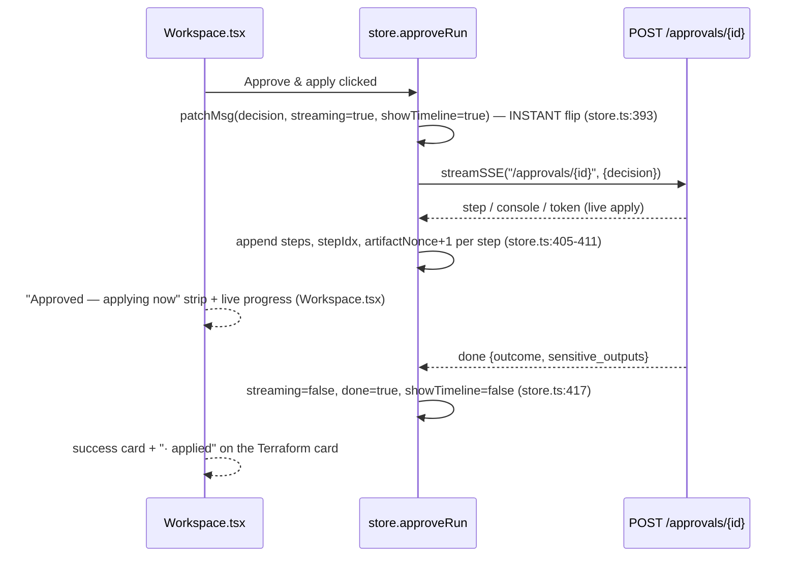

# 04 · UI Data Flow

Next.js 14 + Zustand. One store (`lib/store.ts`) drives everything; the pixel-exact components
bind to it. The backbone is: a POST-based SSE client (`lib/sse.ts`) streams graph events into
the store's reducer, which mutates per-message fields, which the components render.

## The three transport layers

- **`lib/api.ts`** — fetch wrapper. `API_BASE` (`api.ts:4`, `NEXT_PUBLIC_API_BASE ??
  http://localhost:8000`); `credentials:"include"` on every call (`api.ts:16`, httpOnly cookie);
  verbs `get/post/patch/put/del` (`api.ts:34-43`); `!res.ok` → throws typed `ApiError` with
  `.status` (`api.ts:6-12,20-29`).
- **`lib/sse.ts`** — `streamSSE(path, body, onEvent)` (`sse.ts:29`): POST, `Accept:
  text/event-stream`, `credentials:"include"`; normalizes sse-starlette's CRLF frames
  (`buffer.replace(/\r\n/g,"\n")`, `sse.ts:62`) then splits on the blank line (`sse.ts:64`).
  **Flag for reviewers:** on `!res.ok` it throws a plain `Error` with only `detail` text, **not**
  `ApiError` — so SSE-driven flows can't see the HTTP status; the four-eyes 403 on `approveRun`
  is matched by message string, not status code (`sse.ts:42-50`, caught at `store.ts:423`).
- **`lib/store.ts`** — the Zustand store + the two SSE reducers (`sendText`, `approveRun`).

## State shape (`UIState`, `store.ts:55-117`)

Chat/run: `messages: ChatMessage[]`, `streaming`, `activeRunId`, `selectedMessageId`,
`sessionId`, `runError`, `queued` (P1-6), `approval`, `input`. Panel: `artifactOpen`,
`activeArtifact: ArtifactTab`, `artifactNonce`, `timelineOpen`. Selectors: `org/env/cloud/region/
model/role` (`cloud` defaults `"Auto (ask me)"` → wire null, `model` `"gemini-3.5-flash"`,
`store.ts:140-143`). Sidebar: `sessions`, `overview`, `feedback`. The single mutation primitive
is `patchMsg(set, id, patch)` (`store.ts:119`).

`ChatMessage` (`types.ts:81-111`) carries every field the reducer writes: `runId`, `messageId`,
`text`, `steps`/`stepIdx`, `analysis`, `references`, `confidentiality`, `paramRequest`,
`interrupt`, `consoleLines`, `error`, `retry` (U7), `done`, `decision` (P0-3),
`sensitiveOutputs` (N-02), `tab`.

## SSE vocabulary → reducer → render

`sendText` (`store.ts:262`) POSTs `/chat` and switches on each event (`store.ts:308-363`):

| SSE event | store mutation | side effect | renders as |
|---|---|---|---|
| `run` | `patchMsg(runId)` (`:312`) | `activeRunId=rid`, adopt sessionId (`:314`) | panel binds to this run |
| `step` | append `steps`, `stepIdx=len-1` (`:319`) | — | live "AI activity" timeline spinner (`Workspace.tsx:130-150`) |
| `token` | `text += ev.data.text`, `showTimeline=false` (`:324`) | — | streamed markdown answer |
| `analysis` | `analysis={summary,cards}` (`:327`) | — | Analysis/Reasoning tab |
| `params` | `paramRequest=ev.data` (`:331`) | — | "Required to proceed" card |
| `reference` | append `references` (`:334`) | — | References list |
| `confidentiality` | `confidentiality={level,score}` (`:337`) | — | the confidentiality badge |
| `console` | append `consoleLines` (`:340`) | — | Logs tab console |
| `interrupt` | `interrupt=ev.data`, `runId`, `showTimeline=false` (`:343`) | `approval="pending"`, open panel, `activeArtifact="terraform"`, `artifactNonce+1` (`:345`) | the Terraform Plan approval card |
| `error` | `error=msg`, `retry=ev.data.retry` (`:351`) | `runError` set (`:353`) | red error box + "Retry with fix" (U7) |
| `done` | `streaming=false`, `done=true`, `sensitiveOutputs` (`:357`) | `activeRunId`, `artifactNonce+1` (`:360`) | success card + credential reveal |

`finally` (`store.ts:367-379`) clears streaming, refreshes the sidebar, and **flushes the P1-6
queue** — a message typed mid-stream (`queued`, set at `store.ts:269`) auto-sends as its own
turn.

## Per-message run binding

Each assistant message keeps its **own** `runId`. `selectMessage` (`store.ts:172`) pins the
artifact panel to a specific message's run. The panel's `panelMsg` selector
(`ArtifactPanel.tsx:25-29`) is: pinned message wins, else the newest AI message with a run (or
streaming). So clicking any past message shows that run's timeline/logs/traces.

## Artifact panel — 8 tabs (`ArtifactPanel.tsx`)

The tab key **is** the URL segment: `api.get('/runs/{runId}/{activeArtifact}')`
(`ArtifactPanel.tsx:46`), refetched whenever `[runId, activeArtifact, artifactNonce]` changes
(`:53`) — so every `step`/`interrupt`/`done`/approval bumps the nonce and the docked panel
advances live.

| # | tab | endpoint | renders |
|---|---|---|---|
| 1 | Timeline | `GET /runs/{id}/timeline` | `data.nodes[]` (status/title/detail/time); **live override** from `liveSteps` while streaming (`ArtifactPanel.tsx:78,125`) |
| 2 | Reasoning | `GET /runs/{id}/reasoning` | `data.cards[]` (privacy-safe summary, not raw CoT) |
| 3 | Terraform | `GET /runs/{id}/terraform` | `summary.{add,change,destroy}`, `policy_checks[]` (P8 not-evaluated honesty), `defaults[]`, `diff[]` |
| 4 | Logs | `GET /runs/{id}/logs` | `data.lines[]`; **live console overlay** from `liveConsole` (`ArtifactPanel.tsx:83-92`) |
| 5 | Metrics | `GET /runs/{id}/metrics` | `data.cards[]` (real Prometheus series) |
| 6 | Traces | `GET /runs/{id}/traces` | `data.spans[]` (real durations from run_steps) + `data.deep_link` "Open in Langfuse" |
| 7 | References | `GET /runs/{id}/references` | `data.references[]` (title/source/relevance) |
| 8 | Approvals | `GET /runs/{id}/approvals` | `data.{status,risk,affected,servicenow,cost_impact}` + `decisions[]` |

Tab list source of truth: `data.ts:339-359`. Endpoints implemented in `api/artifacts.py`.

## Approval card lifecycle (P0-3)

- **Instant flip:** the decision lands on the message before any event (`store.ts:393`), so the
  card replaces the buttons immediately.
- **Denial is visible (four-eyes 403):** `catch` at `store.ts:423-429` sets `runError`, restores
  `approval="pending"`, and puts `decision:null, error:msg` on the message so the card returns
  for a legitimate approver.
- **Restoration on session open:** `openSession` (`store.ts:197`) fetches `GET /runs/{id}`
  (`store.ts:215`) and, if `status == "awaiting_approval"`, rebuilds the interrupt card
  (`store.ts:216-219`) — essential because under four-eyes the approver is a different person
  than the initiator whose live window streamed the interrupt.

## Credential reveal / download (`Workspace.tsx:CredentialReveal`)

On a `done` with `outcome.sensitive_outputs`, the message carries `sensitiveOutputs` and the
success card renders one-time reveal rows. Reveal `POST /runs/{id}/credentials` with a step-up
password (`Workspace.tsx` submitReveal); the value lives only in component state, never
persisted. The download builds a Blob (`.pem` for keys, `.txt` otherwise); keys show a
`chmod 600` hint once (STAB P1-3). The server serves each value exactly once (410 on a second
reveal, `api/artifacts.py:reveal_credential`).

## Session restore

`persistLast(id)` / `readLast()` (`store.ts:15-31`) keep the open session id in localStorage.
`restoreLast` (`store.ts:254`) loads the sidebar then re-opens the last session **only if it
still exists server-side**. `fromApiMessage` (`store.ts:34`) maps persisted rows back to
`ChatMessage`, remapping wire keys (`run_id`→`runId`, `analysis.reasoning`→`analysis.cards`,
`analysis.param_request`→`paramRequest`).

## Selectors (`TopNav.tsx`) — honest surface

TopNav renders exactly three selectors: **Cloud** (`TopNav.tsx:90`, `cloudOptions`), **Model**
(`:141`, `modelOptions`), and **Role** inside the profile menu (`:345`, `roleOptions`). **No
org / env / region picker is rendered** — the org comes from the authenticated principal (S0),
env is fixed to Production in the store, and the region selector never shipped a menu. The store
still holds `org/env/region` and `setSelector` still accepts them (`store.ts:166`), but no UI
mutates them (the dead option lists were removed in CLN-2, `data.ts:14-17`).

## Auth (`lib/auth.tsx`)

`AuthProvider` (`auth.tsx:20`) hydrates `user` from `GET /auth/me` on mount (`auth.tsx:25`),
cookie-only (no client token). `login` (`auth.tsx:40`) / `ssoLogin` (`auth.tsx:52`, full
redirect to `/auth/sso/login`) establish the server cookie; `logout` (`auth.tsx:56`) clears it.
`useAuth` exposes `user` with `can_approve`/`can_initiate`/`can_execute` (`types.ts:8-10`);
capability-gating lives in the consuming components (e.g. the composer's read-only notice, the
Approve button), not in the provider itself.
