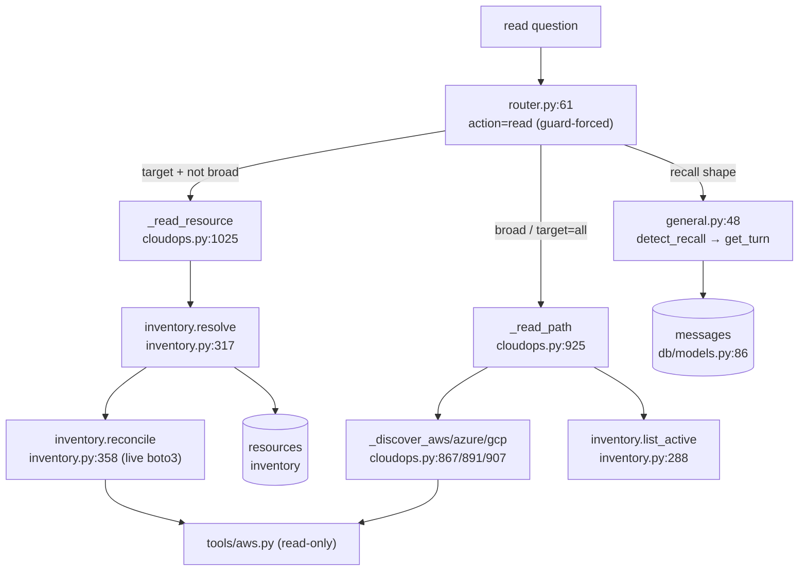

# 05 · Source-of-Truth Reads

For every "read" question, the resolution chain: router classification → which store(s) →
which functions → how a live SDK reconcile merges → how honesty statuses surface. The
system-of-record is **Postgres** (`messages` for conversation, `resources` for inventory);
**Neo4j** is a derived world model; cloud SDKs provide the **live** overlay (read-only).

## Question type → resolution chain

### "What did I say earlier / in turn N?" → `messages`, LLM-free

Router classifies (chat LLM), routes to `general`. `general` short-circuits **before any LLM
call**: `detect_recall` (`memory.py:91`, regex `_RECALL_RE` `memory.py:35`) parses the ordinal,
`get_turn` (`memory.py:77`) reads `load_history` (`memory.py:48`) and returns the turn
**verbatim** (`general.py:48-57`). Survives an LLM outage; cannot hallucinate a different turn.
Semantic "what did I say about X" uses `retrieve` (`memory.py:112`, pgvector cosine, pg_trgm
keyword fallback). Full detail: [03_harness.md](03_harness.md) §Memory.

### "What services exist in AWS?" (broad) → discovery + inventory merge

`_read_path` (`cloudops.py:925`), LLM-free. Clouds chosen from words in the message else
resolved/all-configured (`cloudops.py:939`). Live read-only discovery per cloud
(`_discover_aws` `:867` counts running EC2/S3/RDS/EKS/VPCs; `_discover_azure` `:891`;
`_discover_gcp` `:907`) — creds absent → `"credentials not configured"` (not a fake count).
**Merged** with the inventory table (`inventory.list_active`, `cloudops.py:967`); a broad
question renders the full markdown table (`_render_inventory_list`, `cloudops.py:1001`, STAB
P1-2a). **Honesty:** a cloud whose live discovery *raised* is added to `failed_clouds`
(`cloudops.py:959`) and its inventory rows are stamped `⚠ unverified` (`cloudops.py:977`,
`:1017`) — never silently "active".

### "What's the VPC / IP of web-01?" → inventory + live reconcile, LLM-free

`_read_resource` (`cloudops.py:1025`):
1. `inventory.resolve(org_id, target)` (`inventory.py:317`) → `(matches, kind)`. Exact name,
   then substring either-direction, then descriptive-by-mentioned-type only (`inventory.py:349`)
   — never falls back to a different-type resource. 0 matches → honest not-found (`:1050`);
   >1 → disambiguate (`:1053`).
2. `inventory.reconcile(match, settings)` (`inventory.py:358`) — for `aws/ec2` with a
   provider_id this does a live boto3 `describe_instances` (offloaded, `inventory.py:379`) and
   refreshes `vpc_id/subnet_id/private_ip/public_ip/public_dns/state` (`inventory.py:386-388`);
   a gone instance flips to `status="terminated"` (`:383`). Other types keep recorded values.
3. Render VPC/subnet/IPs from the reconciled attributes (`cloudops.py:1069-1073`); size/type
   from recorded validated inputs (`:1064`); provenance (run/session) from the **context graph**,
   never inferred (`:1079`). No chat LLM on this path.

### "What depends on X?" / destroy impact → Neo4j world model

`world_model.impact_of(org_id, provider_id, name)` (`world_model.py:157`) matches active
`DEPENDS_ON` dependents (`world_model.py:166-169`). Edges are extracted from **real inputs/
outputs only** (`dependencies_from`, `world_model.py:40`; keys `vpc_id/subnet_id(s)/
security_group_id(s)/resource_group/network/cluster_name`, `:27`) — "an edge can never be
hallucinated" (`world_model.py:41`). The destroy card consults it via `_world_model_impact_check`
(`cloudops.py:1098`); if the graph is down the check is `evaluated=False` (pending, **never a
silent pass**, `cloudops.py:1110`). The world model is a derived mirror — `rebuild_from_inventory`
(`world_model.py:77`) reconstructs it from Postgres with no cloud read.

### Drift questions → `drift.py`, read-only comparator

`detect_drift(resource_type, recorded, live)` (`drift.py:127`) is a **pure comparator** over a
curated `DRIFT_FIELDS` set (`drift.py:42`), comparing only fields present in both recorded and
live, lists order-insensitively (`drift.py:135-140`). The live side is a read-only cloud read via
the `LiveReader` seam (`drift.py:51`, `Ec2Reader` `:61`, offloaded); a resource type with no
registered reader is **counted `skipped`, never guessed** (`drift.py:208`). Three finding kinds:
`drift`, `deleted_outside` (MISSING sentinel, `drift.py:38,218`), `orphan` (a `ManagedBy=aegisops`
cloud resource with no active inventory row, `drift.py:237`). Findings dedup 24h in Redis
(`_notify_once`, `drift.py:151`) and mirror onto the world-model node. Gated by `aegisops_drift`.

## Honesty statuses — how they surface

| Status | Set by | Shows up as |
|---|---|---|
| `active` | `record_from_apply` on a successful apply (`inventory.py:174`) | normal inventory row |
| `unreachable` | `mark_unreachable` CLI (`inventory.py:221`) — rotated-away sandbox creds | excluded from `list_active`, so never offered as a DEP parent / day-2 target |
| `terminated` | `reconcile` when the live describe finds the instance gone (`inventory.py:383`) | flagged non-active on the read card |
| `destroyed` | `mark_destroyed` after a gated destroy (`inventory.py:268`) | never appears in `list_active`; not resurrected by the sweeper (BUGFIX-4 guard, `inventory.py:202-206`) |
| `⚠ unverified` | a cloud whose live discovery raised during a broad read (`cloudops.py:959,977`) | inline warning on the row — never presented as verified "active" |

## Store roles summary

| Store | Role | Key functions |
|---|---|---|
| Postgres `messages` | conversation system-of-record; feeds all memory layers | `load_history` (`memory.py:48`), `get_turn` (`:77`), `retrieve` (`:112`) |
| Postgres `resources` | inventory system-of-record | `list_active` (`inventory.py:288`), `resolve` (`:317`), `reconcile` (`:358`), `record_from_apply` (`:174`) |
| Neo4j | derived world model (dependency graph) | `impact_of` (`world_model.py:157`), `dependencies_from` (`:40`), `rebuild_from_inventory` (`:77`) |
| Cloud SDKs | live read-only overlay | `_discover_*` (`cloudops.py:867+`), `reconcile`'s boto3 describe, drift readers |
| Context graph (Neo4j) | run/approval provenance | `inventory.provenance` (`inventory.py:278`) |

Every read path above is LLM-free except the router's domain classification; the *answers* are
computed deterministically from the stores.
