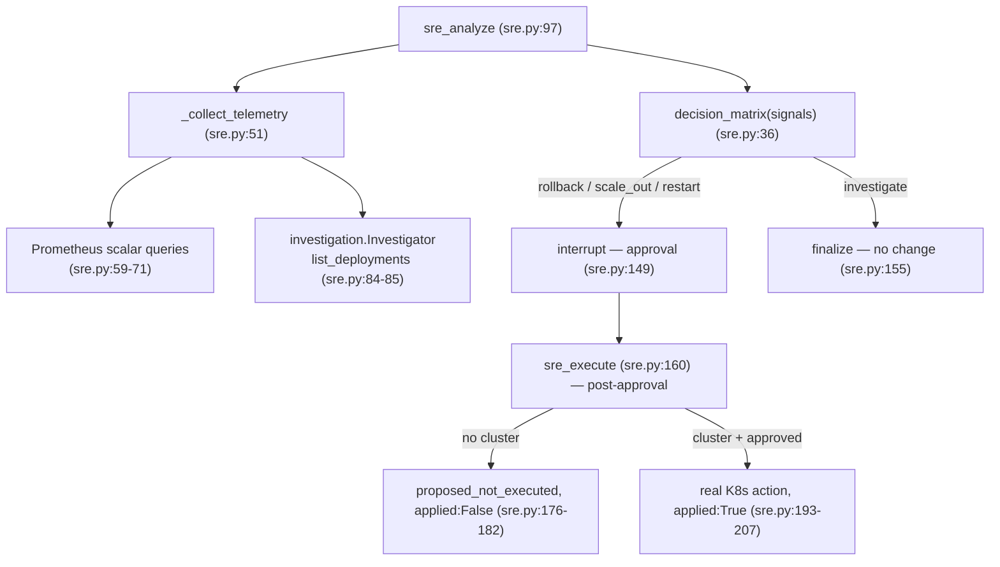

# 07 · DevOps + SRE

Both domains follow the same split-trust shape as CloudOps: a `*_plan`/`*_analyze` node does
read-only work and raises the approval interrupt; a `*_execute` node (reached only after
approval) does the real mutation. Enablement is a runtime check (token/kubeconfig/URL present),
and when absent the code returns an honest "not configured / proposed" result — never fakes
success.

## DevOps — staged pipeline (`agents/devops.py`, `tools/github.py`)

Six stages, a module constant (`devops.py:28-31`):
`ENSURE_REPO_EXISTS → ENSURE_WORKING_COPY → ENSURE_CHANGES_PUSHED → ENSURE_CI_RUN →
ENSURE_IMAGE_EXISTS → ENSURE_K8S_DEPLOYED`.

```mermaid
sequenceDiagram
    participant chat as api/chat.py
    participant dp as devops_plan (devops.py:67)
    participant de as devops_execute (devops.py:132)
    participant gh as tools/github.py
    participant k8s as tools/kubernetes.py

    chat->>dp: router → devops_plan
    dp->>gh: gh.repo_exists(repo)  (read-only, devops.py:90)
    dp-->>chat: interrupt — 6-stage plan (devops.py:124) · approval_status=pending
    Note over chat: human approves → graph resumes → execute → devops_execute
    de->>gh: ensure_repo / upsert Dockerfile+ci.yml / push marker  (devops.py:161-170)
    de->>gh: since=now(); dispatch_workflow(ci.yml)  (devops.py:174-177)
    de->>gh: find_dispatched_run(repo, ci.yml, branch, since)  (devops.py:178)
    Note over gh: dispatch returns a bool (no id) → identify newest workflow_dispatch run ≥ since (github.py:112)
    de->>gh: poll_run_to_completion(run_id)  (devops.py:195 / github.py:143)
    alt conclusion != success
        gh-->>de: raise GitHubError → outcome "failed"  (devops.py:196-197,207)
    else run not visible yet
        gh-->>de: {status:"dispatched", note:"not yet visible"} — honest, no fake build (devops.py:187-191)
    end
    de->>k8s: if k8s.enabled and image: apply_deployment  else skip  (devops.py:202-206)
    de-->>chat: outcome "deployed"  (devops.py:213)
```

The **dispatch → identify → poll → conclusion** sequence is the crux: `dispatch_workflow`
returns a bool, not a run id (`github.py:106`), so a timestamp is captured *before* dispatch
(`devops.py:174`) and `find_dispatched_run` (`github.py:112`) finds the newest
`workflow_dispatch` run on the branch created at/after it — returning `None` (never fabricating)
if the run hasn't surfaced (`github.py:134`). Honesty behaviors, exactly as coded:

- **Failure fails the pipeline:** a completed run with `conclusion != "success"` raises, which
  propagates to outcome `failed` (`devops.py:196-197,207-209`).
- **Not-yet-visible is honest:** no run id → `{status:"dispatched", note:"CI run not yet visible
  from the GitHub API"}`, never claimed success (`devops.py:187-191`).
- **Timeout is honest:** `poll_run_to_completion` exits at the 600s bound returning the last
  non-`completed` status, which the `status=="completed"` guard means does NOT raise — reported
  as-is, not asserted success (`github.py:151,157`, `devops.py:196`).
- **K8s deploy is conditional:** real `apply_deployment` only when `k8s.enabled and image`
  present, else skipped with an honest console note (`devops.py:202-206`).

Disabled guard: no GitHub token → `devops_plan` returns `not_required` with no change
(`devops.py:73-77`). Every mutation lives only in `devops_execute` (post-approval).

## SRE — triage → signals → investigation → decision → gated remediation

`sre_analyze` (`sre.py:97`): triage → collect telemetry (real Prometheus + read-only K8s
investigation) → RAG runbooks → decision matrix → LLM analysis (with a heuristic fallback on
`GeminiError`, never fake telemetry) → gate.



### Real Prometheus signals (verbatim PromQL, `sre.py:59-71`)

`recent_deploy` defaults `False` and is never assumed (`sre.py:56`). Queries run through
`PrometheusClient.scalar` (`prometheus.py:46`, retry ×3) only when `prom.enabled and ping()`
(`sre.py:58`):

| Signal | PromQL |
|---|---|
| targets_up | `sum(up)` |
| error_rate | `sum(rate(aegisops_api_requests_total{status=~"5.."}[5m])) / clamp_min(sum(rate(aegisops_api_requests_total[5m])),1)` |
| recent_deploy | `sum(changes(kube_deployment_status_observed_generation[15m]))` → `> 0` (`sre.py:67`) |
| cpu_saturation | `max(1 - rate(node_cpu_seconds_total{mode="idle"}[5m]))` |
| pod_restarts | `sum(increase(kube_pod_container_status_restarts_total[15m]))` |

### Read-only investigation (`agents/investigation.py`)

K8s triage evidence is gathered through the frozen, budget-bounded read-only registry
(`sre.py:83-85`) — see [03_harness.md](03_harness.md) §Tools/INV. It cannot mutate: registration
rejects mutation-marked names (`investigation.py:49`), the registry freezes after build
(`:72`), `spawn()` shares the same frozen registry + budget (`:125`), and `MAX_CALLS=8` (`:28`).

### Decision matrix (deterministic, first-match, `sre.py:36`)

| Priority | Condition | Action |
|---|---|---|
| 1 | `error_rate > 0.05 AND recent_deploy` (`sre.py:38`) | **rollback** |
| 2 | `cpu_saturation > 0.85` (`sre.py:41`) | **scale_out** |
| 3 | `pod_restarts > 3` (`sre.py:44`) | **restart** |
| 4 | else (`sre.py:47`) | **investigate** (no gate) |

Only `{rollback, scale_out, restart}` raise the approval gate (`sre.py:144`); `investigate`
finalizes with no change.

### Gated remediation — proposed vs applied (`sre_execute`, `sre.py:160`)

Reached only after human approval. Three paths:

- **No cluster** (`k8s.enabled` requires an on-disk kubeconfig, `kubernetes.py:32`) →
  `status:"proposed_not_executed", applied:False` (`sre.py:176-182`) — never a fake apply.
- **action == investigate** → also proposed, not executed (`sre.py:185-190`).
- **Cluster present + approved** → real AppsV1 patches: `restart_deployment` (annotates
  `restartedAt`, `kubernetes.py:89`), `scale_deployment` (patches `spec.replicas`; reads current
  first, `kubernetes.py:105`, `sre.py:196`), `rollback_deployment` (patches the pod template back
  to the prior ReplicaSet revision, `kubernetes.py:117`) → `status:"remediated", applied:True`
  (`sre.py:207`). A failed action is honest: `remediation_failed, applied:False`
  (`sre.py:209-213`). Each K8s method calls `self._load()` which raises if disabled
  (`kubernetes.py:38`), and wraps the SDK call → `KubernetesError`.

## Common shape

Both domains keep the platform invariant: **no mutation without a passed approval interrupt**.
DevOps `repo_exists`/`_extract` and all SRE telemetry are read-only; the side-effecting work
(`git`/CI/K8s mutations, K8s remediation patches) lives only in the `*_execute` nodes the graph
reaches after `emitter.interrupt(...)` (`devops.py:124`, `sre.py:149`). Clients are lazy
singletons gated on real credentials (`github.py:180`, `kubernetes.py:151`, `prometheus.py:64`).
