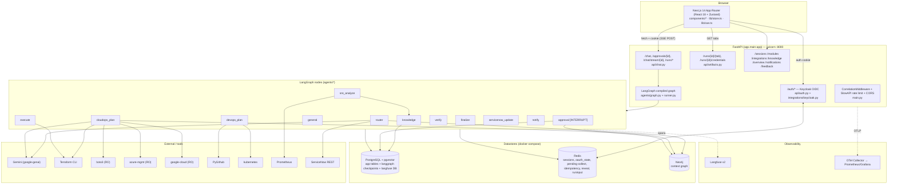

# 01 — End-to-end architecture

[← back to index](../../ANALYSIS.md)

## 1.1 Component map



**Service processes** (from `docker-compose.yml`): `postgres` (pgvector/pgvector:pg16), `redis` (7.4), `neo4j` (5.26 + APOC), `keycloak` (25, realm auto-import), `langfuse` (v2, own `langfuse` DB in the same Postgres), `otel-collector` (contrib 0.115.1), `prometheus` (v2.55.1), `grafana` (11.4.0), and profile-gated `api` + `frontend`. Default `docker compose up -d` starts only the backing services; the app runs on the host via `make dev` (or `--profile full`).

## 1.2 The request lifecycle (CloudOps provisioning, the richest path)

Trace of "create a t3.micro EC2 in AWS" end to end, function by function:

1. **Browser** — `frontend/lib/store.ts:sendText` appends a user + placeholder-assistant message, ensures a session (`POST /sessions` → `id`), then opens a POST SSE stream via `frontend/lib/sse.ts:streamSSE("/chat", …)`. The SSE client normalizes `\r\n`→`\n` before splitting frames (this was the historical "dead UI" fix) and dispatches per-event to the store's reducer.

2. **`POST /chat`** (`api/chat.py:chat`) — resolves the org (`repo.get_default_org`), reuses or creates the `Session`, inserts the user `Message` and a `Run(status="running")`, binds correlation ids, creates an in-process `RunChannel` (`agents/events.create_channel`), and spawns `_drive()` as a fire-and-forget `asyncio.create_task`. Returns `EventSourceResponse(_sse(channel))` immediately.

3. **`_drive`** emits the leading `run` event `{runId, sessionId}` first (so the UI binds its live panel), then calls `agents/runner.run_graph(run_id, channel, initial=…)`.

4. **`run_graph`** (`agents/runner.py`) — opens the Langfuse trace with `id == run_id`, opens an OTel `agent.run` span, and calls `graph.ainvoke(initial, config)` where `config.configurable = {thread_id: run_id, emitter}`. On return it reads `graph.aget_state(config).next` to detect an interrupt, upserts the final trace, and `flush()`es.

5. **`router`** (`agents/router.py`) — first checks Redis for a pending param-collection record (`params.load_pending`). If present and the message is a plausible *answer* (`intent_guard.is_new_request` is false), it short-circuits and continues the pending request. Otherwise it calls Gemini (`llm.classify_json`) with the catalog + recent-turn memory (`memory.classification_context`), gets `{domain, cloud, resource, action, target, intent, confidence, reason}`, applies the deterministic `intent_guard.guard_classification` safety overrides, creates a ServiceNow ticket for actionable domains, and opens the Neo4j context graph.

6. **Conditional edge `_after_router`** (`agents/graph.py:58`) routes to `cloudops_plan` (or clarifies via `general`).

7. **`cloudops_plan`** (`agents/cloudops.py:153`) — branches by `action`:
   - `read` with a specific target → `_read_resource`; `modify` → `_modify_resource`; `destroy` → `_destroy_resource`; broad `read` → `_read_path`. For **create**: `resolve_cloud` → `templates.select(cloud, resource)` → `_extract_inputs` (Gemini + free-form parse) → `params.missing_required`. If params missing, emit a `params` card + save a Redis pending record and stop (no plan). If complete, validate against the Pydantic schema, run an S3-name/duplicate-name precheck, run `_availability` (SDK read), then `TerraformRunner.init/plan/show_plan` in a per-resource state workspace, run `plan_guard.check_plan_actions("create", diff)`, compute policy checks, emit `analysis` + `interrupt`, and return `needs_change=True, approval_status="pending"`.

8. **`approval`** (`agents/approval.py`) — `_after_plan` routes here; `timing.start_step("approval")` then `interrupt(payload)` **pauses the graph**. `graph.ainvoke` returns; `run_graph` sees `snapshot.next` non-empty → `interrupted=True`. `_drive` persists the run as `awaiting_approval` and does **not** emit `done`. The SSE stream ends after the `interrupt` event.

9. **Human decides** — UI shows Approve/Reject (RBAC-gated on `user.can_approve`). `POST /approvals/{id}` (`api/chat.py:resolve_approval`, `Depends(require_approver)`) checks the run is `awaiting_approval`, opens a fresh channel, and calls `run_graph(resume=Command(resume={decision,…}))`. The graph re-enters `approval`, `interrupt()` returns the decision, records an immutable `Approval` row + graph node, then `approval_decision` routes to `execute` (approved) or `finalize` (rejected).

10. **`execute` → `cloudops_execute`** (`agents/cloudops.py:914`) — claims an idempotency key, `TerraformRunner.apply()` (streams console lines as `console` events), records the resource into the Postgres inventory + Neo4j graph.

11. **`verify`** (`agents/finalize.py:44`) — timeout-bounded (30s) read-only SDK reconciliation (EC2 describe / S3 head; AWS-only), then posts a success card (`agents/cards.success_card`) into the chat.

12. **`finalize` → `servicenow_update` → `notify` → END** — compose resolution, close the context graph, close/patch the ServiceNow record, persist an in-app notification (+ optional SMTP email). `_drive` persists the assistant `Message` + final `Run` state and emits `done`.

13. **Artifact panel** — throughout, the UI's `ArtifactPanel` binds to the selected message's `runId` and fetches `GET /runs/{runId}/{tab}` (timeline/reasoning/terraform/logs/metrics/traces/references/approvals), refetching whenever `artifactNonce` bumps (run start/interrupt/done/approval).

## 1.3 The SSE event contract

Emitted by `agents/events.py:Emitter`; consumed by `frontend/lib/store.ts:sendText`/`approveRun`. `_sse` (`api/chat.py:57`) de-dupes by monotonic `id` so an event present in both the replay buffer and the live queue is delivered exactly once.

| event | payload | UI effect |
|-------|---------|-----------|
| `run` | `{runId, sessionId}` | Binds the message to its run; adopts server session id. **Always first, exactly once.** |
| `step` | `{index, label}` | Appends a live-timeline step. |
| `token` | `{text}` | Appends streamed answer text (renders as markdown). |
| `analysis` | `{summary, reasoningCards}` | Fills the Analysis/References tab. |
| `params` | `{template, items[], collected}` | Renders the "Required to proceed" card. |
| `reference` | `{title, source, url, relevance}` | Appends a RAG citation. |
| `confidentiality` | `{level, score}` | Sets the message's confidentiality badge. |
| `console` | `{stream, line}` | Appends a live console line (overlaid on the Logs tab). |
| `interrupt` | `{kind:"approval", runId, plan, diff, policyChecks, mode, cloud, resource}` | Opens the Terraform plan + approval gate. |
| `error` | `{message, code, retriable}` | Surfaces an error on the message. |
| `done` | `{messageId, runId, traceId, contextId, snowId, outcome}` | Terminal; clears `streaming`; surfaces revealable credentials. |

Reconnect/replay: `GET /chat/stream/{run_id}` with `Last-Event-ID` returns `_sse(channel, replay_after=id)`. **Caveat:** this only works while the run's `RunChannel` still exists in *this* process's `_channels` dict (`agents/events.py:41`) — see [09 · problems](09_problems.md) on the single-process limitation and the channel leak.

## 1.4 The LangGraph graph (compiled once at startup)

From `agents/graph.py:build_graph`:

```
START → router
router ─(needs_clarification)→ general
       ─cloudops→ cloudops_plan ─(clarify)→ general
       ─devops→   devops_plan   ─(needs_change & pending)→ approval
       ─sre→      sre_analyze   ─(else)→ finalize
       ─knowledge→ knowledge → finalize
       ─general→   general   → finalize
approval ─approved→ execute → verify → finalize
         ─rejected→ finalize
finalize → servicenow_update → notify → END
```

- **Checkpointer**: `AsyncPostgresSaver` over a psycopg pool (`agents/checkpointer.py`); `thread_id = run_id`. `await saver.setup()` creates the checkpoint tables on boot. This is what makes the approval interrupt durable across restarts.
- **Timing wrapper** (`graph.py:_timed`): every node except `approval` and `cloudops_plan` is wrapped to record `run_steps` start/end + open a Langfuse span. `approval` self-times across the interrupt (upsert preserves the original `started_at`, so "Human Approval" shows true wall-clock wait). `cloudops_plan` records finer sub-steps (`cloudops_agent`, `policy_evaluation`, `planner`).
- **Emitter injection**: nodes reach the per-run SSE emitter via `config["configurable"]["emitter"]` (`agents/runtime.py:emitter_of`).

## 1.5 Deployment / runtime topology

| Service | Image | Host port → container | Healthcheck |
|---------|-------|-----------------------|-------------|
| frontend | built (Next standalone) | 3000 → 3000 | — (profile `full`) |
| api | built (py3.11-slim + TF/kubectl/ansible) | 8000 → 8000 | `GET /healthz` |
| postgres | pgvector/pgvector:pg16 | 5432 | `pg_isready` |
| redis | redis:7.4-alpine | 6379 | `redis-cli ping` |
| neo4j | neo4j:5.26 | 7474/7687 | HTTP 7474 |
| keycloak | quay.io/keycloak/keycloak:25 | 8080, 9000 | `/health/ready` on 9000 |
| langfuse | langfuse/langfuse:2 | 3001 → 3000 | `/api/public/health` |
| otel-collector | otel contrib 0.115.1 | 4317/4318/8889 | — |
| prometheus | prom/prometheus:v2.55.1 | 9090 | — |
| grafana | grafana/grafana:11.4.0 | 3002 → 3000 | — |

Notes grounded in the compose files:
- **`docker-compose.override.yml`** mounts host `./backend/app` over the baked image and `./infra/secrets:/secrets:ro` (GCP SA key). It exists because image rebuilds on the OneDrive/Windows host intermittently fail to invalidate the COPY cache.
- The **`api-test`** service (profile `test`) reuses `aegisops-api:local`, `pip install`s pytest at runtime, mounts the full `./backend`, runs as root, points integration tests at live compose datastores (`AEGISOPS_TEST_LIVE_DATASTORES=1`), and `chmod -R a+rwX`s the terraform workspaces on exit (so root-created `terraform.tfstate.d/` dirs don't block the non-root API user).
- The **Terraform state** lives on the `tfstate` named volume, but the **workspace modules** are a bind mount of `./infra/terraform-workspaces` — and dozens of `*.tfplan` files are checked into git (see [13 · files read](13_files_read.md)), which is a hygiene problem (plan files embed variable values).
- The API image bakes Terraform 1.9.8, kubectl 1.31.3, and Ansible; cloud CLIs are not needed because the SDKs are used for reads and the Terraform providers for writes.
