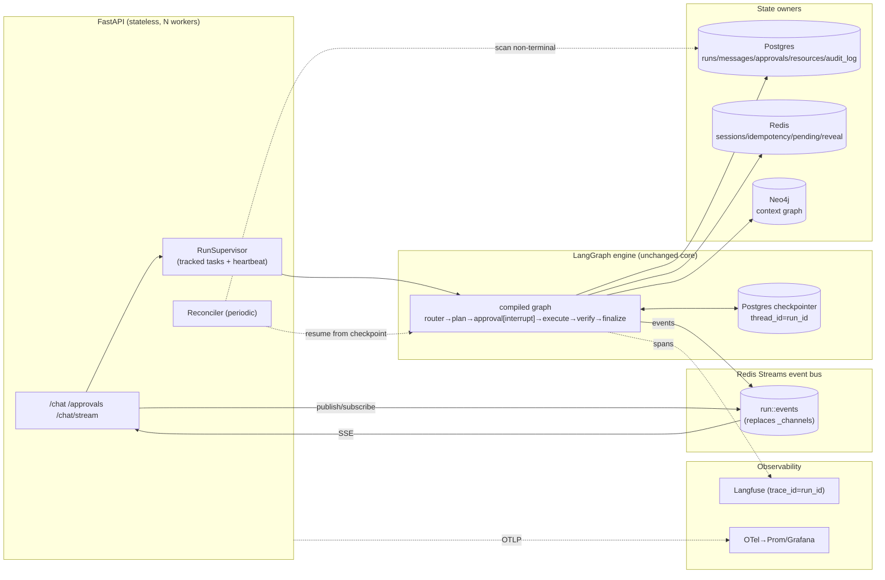

# §2 — The harness

[← back to FIX index](../../FIX.md) · Grounded in [ANALYSIS §01 architecture](../analysis/01_architecture.md), [§09 problems](../analysis/09_problems.md), [§10 gap analysis](../analysis/10_gap_analysis.md).

The **harness** is the orchestration/execution engine that turns a user request into governed, multi-step, resumable, observable cloud action. Today that's LangGraph + the SSE/agent/approval/terraform/verify machinery. This section is the heart of the plan: what the harness is, what's structurally wrong, what to replace it with, how it works end-to-end, and how it beats the competition.

> **Stage-A amendment (2026-07-11, per [`AEGISOPS_TARGET_ARCHITECTURE.md`](../../AEGISOPS_TARGET_ARCHITECTURE.md), decisions 7–8):** the harness is now framed as a **Split-Trust** system — a deterministic **Governed Core** for all mutation and an LLM-driven **Intelligent Shell** for planning/investigation — and the §2.3 bounded planner evolves into the **Governed Executive Loop**. See §2.7 below. Everything else in this document stands unchanged.

---

## 2.1 Current harness — how it actually works

From the code (`agents/graph.py`, `runner.py`, `events.py`, `checkpointer.py`, `approval.py`, `api/chat.py`):

```
POST /chat ─ api/chat.py:chat
  │  inserts Session/Message/Run(status=running)
  │  create_channel(run_id) → RunChannel in a process-global _channels dict   (agents/events.py:41)
  │  asyncio.create_task(_drive())          ← FIRE-AND-FORGET, unsupervised    (api/chat.py:171)
  └─ returns EventSourceResponse(_sse(channel))   ← streams from the in-process queue

_drive ─ api/chat.py:138
  └─ run_graph(run_id, channel, initial)   ─ agents/runner.py:36
       └─ graph.ainvoke(initial, {configurable:{thread_id:run_id, emitter}})
            router → cloudops_plan → approval[interrupt] → execute → verify → finalize → …
            checkpointed after every node by AsyncPostgresSaver   (agents/checkpointer.py)

POST /approvals/{id} ─ api/chat.py:resolve_approval  (Depends require_approver)
  └─ create_channel(run_id) again  → run_graph(resume=Command(resume=decision))
       graph re-enters approval; interrupt() returns; execute…
```

**What is genuinely good and must be preserved:**
- The **LangGraph state machine** is explicit and safe (`build_graph`), not an autonomous tool loop.
- The **Postgres checkpointer** (`AsyncPostgresSaver`, `thread_id=run_id`) makes the **approval interrupt durable across restarts** — this is real and verified (ANALYSIS finding #2).
- **Safety guards** (`intent_guard`, `plan_guard.check_plan_actions`, per-resource `state_workspace`) sit correctly *inside* the graph nodes.
- **Exactly-once SSE** ids + Last-Event-ID replay logic (`_sse`, `RunChannel.replay_after`) is correct — *as long as the channel exists*.

## 2.2 Current harness — structural weaknesses (evidence)

The failures are **not in LangGraph**. They are in the layers wrapped around it:

| # | Weakness | Evidence | Consequence |
|---|----------|----------|-------------|
| H1 | **Transport is in-process only.** The SSE bus is a module-global dict, never evicted. | `agents/events.py:41 _channels`; `drop_channel` called only in `test_sse_contract.py` (ANALYSIS P4) | Unbounded memory leak; with >1 worker, `POST /chat` and its reconnect/`/approvals` can hit different processes → `get_channel` None → broken stream & resume. Kills horizontal scaling. |
| H2 | **The drive is unsupervised fire-and-forget.** | `api/chat.py:171 asyncio.create_task(_drive())` | If the API process dies mid-run (mid-`terraform apply`), nothing re-drives it. The checkpoint holds the state, but **only the human-approval pause is ever resumed** (by a user POST). A run stranded in `running` stays stranded → "resumable after restart" is half-true. |
| H3 | **No run supervisor / reconciler.** | no scanner over `runs.status IN (running, awaiting_approval)` exists | Crashed/abandoned runs never reach a terminal state; no timeout on a stuck node other than `verify`'s 30s. |
| H4 | **Idempotency is not race-tight.** | `agents/cloudops.py:935` falls through to `apply()` on an in-flight claim | Concurrent approvals → double apply on the same TF state (ANALYSIS P5). |
| H5 | **Blocking I/O on the loop.** | `agents/inventory.py:229` sync `boto3` in a coroutine | One EC2 read stalls every concurrent stream in that worker (ANALYSIS P6). |
| H6 | **Single-pass graph — no multi-step planning.** | `build_graph` is one classify→one plan→one approval→one apply | Cannot chain resources (VPC→subnet→EC2) or self-correct a failed plan (ANALYSIS §10 §B4). |
| H7 | **Tracing is wired but a UI surface is fake.** | Langfuse trace real; `api/artifacts.py:184 traces()` static | The observability the harness produces isn't fully surfaced (ANALYSIS P9). |
| H8 | **State ownership is diffuse.** run status lives in PG, streaming in RAM, checkpoint in PG (separate tables), pending-collection in Redis, context in Neo4j — written by different nodes with no single owner. | throughout | Cross-store writes aren't atomic (ANALYSIS P14); reasoning about "the run's state" means reading four stores. |

**The through-line:** LangGraph does its job; the *harness around it* is a single-process, unsupervised, non-atomic wrapper. Fixing those layers — not replacing the engine — is the highest-leverage, lowest-risk move.

## 2.3 Proposed harness — candidate comparison

| Option | What it is | Pros for AegisOps | Cons / risk | Verdict |
|--------|-----------|-------------------|-------------|---------|
| **A. Fix LangGraph (recommended)** | Keep the StateGraph + Postgres checkpointer; replace transport (Redis Streams), add a supervised runner + reconciler, add a bounded planner sub-graph | Preserves the one thing that works (durable HITL interrupt); incremental, feature-flaggable; small blast radius per change; team already knows it | LangGraph 0.2.x API churn *(verify current version at impl time)*; still need to build the reconciler + bus ourselves | **Chosen.** Lowest risk, keeps momentum. |
| **B. Replace with Temporal** | Durable-execution workflow engine; workflows/activities in Python | Gold-standard durability, retries, timeouts, versioning, visibility; would subsume H2/H3/H4 natively | Heavy new operational dependency (Temporal server + workers); full rewrite of the graph as workflows/activities; HITL interrupt = signals (re-implement approval); overlaps what LangGraph+PG already give us for **today's short single-resource flows** | **Defer to Phase‑3 decision.** Compelling only once workflows are long/multi-stage/high-fan-out. *(Verify current Temporal Python SDK ergonomics at decision time.)* |
| **C. Custom state machine** | Hand-rolled status column + Redis/DB driver | Zero framework dependency; total control | Re-implements interrupt/resume/checkpoint/replay we already get; loses the span-tree ergonomics; most work, least payoff | **Rejected.** |

**Recommendation: Option A.** Concretely, the fixed harness is **LangGraph (unchanged engine) + four new pieces**:

1. **Durable event bus** — Redis Streams keyed `run:<id>:events`, replacing `_channels`. Any worker publishes; any worker (or a reconnecting client) reads with `Last-Event-ID` = the stream id. Terminal event trims/expires the stream. *(This is the direct fix for H1/P4.)*
2. **Supervised runner** — a `RunSupervisor` that owns run execution as a tracked background task registry (not bare `create_task`), with a heartbeat, so the API knows which runs are live in *this* process, and hands off cleanly on shutdown. *(H2.)*
3. **Stranded-run reconciler** — a periodic sweeper that finds `runs` in non-terminal states with no live supervisor + a stale heartbeat, and either resumes them from the checkpoint (`graph.aget_state`) or marks them `failed` with a real message. *(H2/H3.)*
4. **Bounded planner sub-graph** — an optional CloudOps sub-graph that decomposes a multi-resource request into an ordered DAG, presents it as **one** approval, and executes steps in dependency order, each still guarded. *(H6; competitive phase.)* **[Amended: this item is superseded by the Governed Executive Loop — §2.7. The DAG/one-approval/per-step-guard shape stands; the loop adds observation-driven replanning with deviation-gating and hard bounds.]**

Plus the in-node correctness fixes (idempotency wait-or-abort H4, thread-offload H5) and a single **RunState owner** convention (§2.5).

## 2.4 Proposed harness — end-to-end (component + sequence)

### Component view (to-be)



### Sequence — a governed run, crash-safe and worker-agnostic

```mermaid
sequenceDiagram
  actor U as User
  participant API as FastAPI (any worker)
  participant SUP as RunSupervisor
  participant G as LangGraph
  participant CP as PG checkpointer
  participant S as Redis stream
  participant PG as Postgres
  U->>API: POST /chat (message, sessionId)
  API->>PG: insert Session(owner=user)/Message/Run(status=running, initiated_by)
  API->>S: XADD run:<id>:events {event:"run"}
  API->>SUP: register+run(run_id)
  API-->>U: SSE (subscribes to run:<id>:events)
  SUP->>G: ainvoke(initial)
  G->>CP: checkpoint each node
  G->>S: XADD step/token/analysis/...
  G-->>SUP: interrupt(approval) → run=awaiting_approval
  Note over U,S: user may disconnect; stream + state survive
  U->>API: POST /approvals/{id} (approver, re-auth n/a here)
  API->>PG: verify run belongs to user's org + awaiting_approval
  API->>SUP: resume(run_id, decision)
  SUP->>G: ainvoke(Command(resume=decision)) [same thread_id]
  G->>PG: Approval(immutable) + idempotent apply + inventory (same txn)
  G->>S: XADD console/token/done
  Note over REC: if the worker had died mid-apply, Reconciler resumes from CP
```

## 2.5 Who owns what state (the fix for H8 / P14)

A single convention: **the `runs` row is the authoritative run state; everything else is derived or ephemeral.**

| State | Owner | Store | Rule |
|-------|-------|-------|------|
| Run status / outcome / plan | `runs` row | Postgres | The one source of truth; the reconciler reads only this |
| Graph checkpoint | LangGraph | Postgres (checkpoint tables) | Engine-internal; used to resume |
| Live events | event bus | Redis Streams | Ephemeral (TTL after terminal); rebuildable from `run_steps` |
| Inventory | `resources` | Postgres | **Written in the same txn as the run outcome** (P14) |
| Context graph | ContextGraph | Neo4j | Best-effort mirror; never authoritative |
| Idempotency / pending / sessions / reveal | — | Redis | Ephemeral coordination |
| Traces | Langfuse | Langfuse DB | Derived; `trace_id == run_id` |

## 2.6 How the fixed harness beats Big-4 and rivals Claude Code / ChatGPT / Antigravity

The competitive edge is the **combination in one governed loop** — no single rival has all of it:

| Capability | How the fixed harness delivers it | Why rivals fall short |
|------------|-----------------------------------|-----------------------|
| **Governed autonomy** (plan → human approval → apply, unbypassable, immutable audit) | LangGraph durable interrupt + `approvals` (immutable) + 4-eyes + always-on audit | Claude Code/ChatGPT have no infra approval gate; Big-4 consoles have approvals but no conversational agent driving them |
| **Multi-cloud from one intent** | 14 curated modules + cloud-safe selection, no cross-cloud fallback | Big-4 tools are single-cloud; general agents don't ship governed multi-cloud modules |
| **Seamless conversational continuity** | Token-budgeted memory + per-session retrieval (guarantees old-turn recall) + cross-session resource memory | ChatGPT/Claude Code keep conversation but not infra inventory; Big-4 keep inventory but no conversation |
| **Deterministic, safe execution** | Terraform-only mutation, per-resource state isolation, action↔operation guard | Autonomous agents authoring commands are unsafe for infra; this never lets the LLM author HCL |
| **Full auditability + observability** | trace_id==run_id span tree + context graph + immutable approvals + audit log | Rival agents don't produce an infra-grade audit trail |
| **Crash-safe, resumable, scalable** | Redis-bus + supervisor + reconciler + PG checkpoint | The current single-process design doesn't; this is what makes it *production* |

**The one-sentence pitch the fixed harness earns:** *"A governed, multi-cloud infrastructure agent with the conversational continuity of Claude Code, the approval/audit rigor of an enterprise change-management system, and crash-safe durable execution — in a single loop."* No change from this plan compromises the safety posture that is already the codebase's strongest asset; every change either hardens it or makes it scale.

---

## 2.7 Split-Trust and the Governed Executive Loop *(Stage-A amendment — decisions 7–8, final)*

Authoritative source: [`AEGISOPS_TARGET_ARCHITECTURE.md`](../../AEGISOPS_TARGET_ARCHITECTURE.md). This section folds it into the harness plan.

### The Split-Trust philosophy (decision 7)

AegisOps is two systems with one boundary:

- **The Governed Core (deterministic — zero LLM trust).** Everything that mutates infrastructure. The LLM never authors HCL, never selects unapproved code, never calls a mutating tool directly, never bypasses a guard. Mutation flows through exactly one pipeline: approved Terraform module → Pydantic validation → plan → `plan_guard` → durable human approval → apply in isolated remote-locked state → verify → record. This is the existing pipeline (ANALYSIS findings #1–#3), hardened by A1–A5/B4/U1/U2 — nothing in this plan weakens it.
- **The Intelligent Shell (LLM-driven — full autonomy where blast radius is zero).** Planning, investigation, observation, adaptation, conversation. Loop-until-done, sub-agent spawning, and replanning are all allowed here because the shell holds only read-only tools plus exactly one path into the core.
- **The boundary:** `execute_governed_step(cloud, resource, action, params)` — the single mutating tool. Its interior is the governed pipeline above. The shell decides *what* and *when*; the core alone decides *how* and *whether*.

**Rejected on record (decision 12):** ephemeral agent-per-tool swarms; trust-the-LLM mutation loops; runtime LLM-generated HCL execution; SDK/imperative "emergency" mutation tiers; replacing LangGraph with Temporal now. If a later directive ambiguously suggests any of these, flag the conflict — do not implement.

### The Governed Executive Loop (decision 8 — supersedes the §2.3 "bounded planner" item)

The bounded planner sub-graph grows into an LLM loop **at the planning level**, built on LangGraph/`create_agent` primitives (verify the installed API at impl time — invariant #9):

1. **Goal → DAG.** For a multi-step request ("VPC → EC2 → EFS → verify"), the loop drafts a **goal DAG**: each node is either an approved module + params or a read-only verification step.
2. **ONE approval for the whole DAG.** The approval artifact is the plan itself — ordered steps, per-step plan summaries + policy checks, cost signal. The human approves the *plan*, not N interrupts (approval fatigue is a failure mode, not a safety feature).
3. **Deterministic execution.** Code — not the LLM — walks the DAG; every step goes through `execute_governed_step` (full core pipeline, per-step `plan_guard`, per-step idempotency).
4. **Observation feedback.** Structured observations (new VPC id, mount-target status, health checks) feed back into the loop to parameterize later steps.
5. **Deviation-gating.** On failure the loop may replan — but any step **not in the approved DAG triggers a fresh approval interrupt**. Approve the plan once; re-approve only surprises.
6. **Hard bounds.** Max steps, max replans per step, budget ceiling. Never an unbounded loop. Feature-flagged `AEGISOPS_EXEC_LOOP=off|on`; the single-resource path stays the default.

**Read-only autonomy is unrestricted:** SRE triage, knowledge research, and multi-cloud discovery run as loop-until-done investigation agents with read-only tools (Prometheus, describe/list, RAG, GitHub reads, world-model queries). Sub-agent spawning is allowed here only; **mutation is never delegated to a spawned agent** (decision 13). The deepagents *package* is permitted for these read-only agents only; re-evaluate at 1.0/LTS.

### How this maps onto the existing harness pieces

| Existing piece (§2.3) | Role under Split-Trust |
|----------------------|------------------------|
| Redis Streams bus (B1) | Unchanged — transports shell *and* core events; per-step progress of a DAG streams on the same contract |
| RunSupervisor (B2) / Reconciler (B3) | Unchanged — supervise loop runs like single-resource runs; the checkpointer + per-step idempotency make DAG re-drive safe |
| LangGraph engine + PG checkpointer | Unchanged core; the executive loop is a new graph (shell) whose mutating edges all pass through `execute_governed_step` |
| plan_guard / intent_guard / state isolation | Unchanged and re-asserted **per DAG step** at the approval choke-point (A2) |
| Durable approval interrupt | Unchanged mechanism; one interrupt may now cover a whole DAG, and deviation raises a fresh one — never bypassed, weakened, or made optional |

**Temporal decision gate (decision 13):** trigger = long-running (hours+) or high-fan-out DAG workflows; revisit at Phase-3 exit with real workflow data. Until then LangGraph + PG checkpointing suffices.
