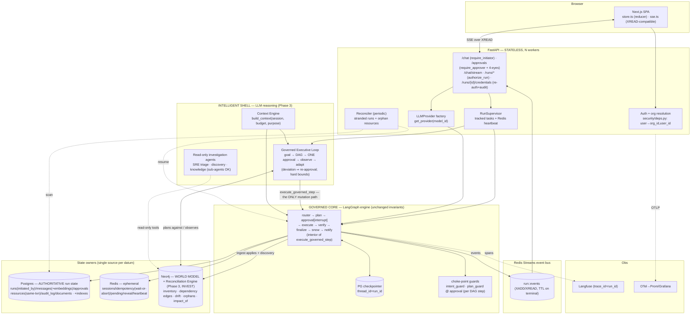

# §4 — Target architecture (the "to-be")

[← back to FIX index](../../FIX.md) · The system after Phases 1–2 land (Phase‑3 differentiators noted inline).

> **Stage-A amendment (2026-07-11):** [`AEGISOPS_TARGET_ARCHITECTURE.md`](../../AEGISOPS_TARGET_ARCHITECTURE.md) (repo root) is the **authoritative** consolidated architecture — where it and this document disagree, it wins. This document is reconciled to it: the system is **Split-Trust** (Intelligent Shell over a Governed Core, boundary = `execute_governed_step`), Neo4j is the Phase-3 **World Model + Reconciliation Engine** (decision 10: INVEST), and the Phase-3 planner is the **Governed Executive Loop** (decision 8). See §4.4.

## 4.1 Component + data-flow (to-be)

## 4.2 Component responsibilities (single responsibility · owned state · interface)

| Component | Single responsibility | Owns | Interface |
|-----------|----------------------|------|-----------|
| **Auth + org resolution** (`security/deps.py`) | Authenticate + resolve principal→(org_id,user_id,capabilities) | nothing (reads Keycloak+`users`) | `get_current_user`, `require_initiator/approver`, `require_fresh_auth`, `authorize_run/session` |
| **API routes** (`api/*`) | HTTP contract, authz enforcement, SSE bridging | nothing durable | REST + SSE |
| **RunSupervisor** (`agents/supervisor.py`, new) | Own live run execution as tracked tasks + heartbeat | in-memory task registry + Redis heartbeat | `run(run_id, initial)`, `resume(run_id, decision)`, `is_live(run_id)`, graceful drain |
| **Reconciler** (`agents/reconciler.py`, new) | Bring stranded runs + orphan resources to a terminal/consistent state | nothing (reads `runs`, checkpoints, TF state) | periodic `sweep()` |
| **LangGraph engine** (`agents/graph.py`+nodes) | Deterministic governed workflow + safety guards | the graph state (checkpointed) | `ainvoke`, `aget_state`, `Command(resume=)` |
| **Event bus** (`agents/events.py`, reimpl) | Durable, worker-agnostic event transport | Redis stream `run:<id>:events` | `Emitter.*` (unchanged), `subscribe(run_id, last_id)` |
| **LLMProvider** (`integrations/llm/`, new) | Model-agnostic LLM ops | nothing | `classify_json/generate/astream/aembed` |
| **Memory** (`agents/memory.py`) | Session context assembly (summary+recent+retrieval) | nothing (reads `messages`+embeddings) | `build_context(session, budget, purpose)`, `get_turn`, `retrieve` |
| **Inventory** (`agents/inventory.py`) | Provisioned-resource truth + resolution + reconcile | `resources` (same-txn write) | `record_from_apply`, `resolve`, `reconcile`, `list_active` |
| **TerraformRunner** (`tools/terraform.py`) | Deterministic plan/apply/destroy in isolated state | per-resource TF workspace + plan file | `init/plan/show_plan/apply/destroy/output/state_list` |
| **Postgres** | Authoritative run/session/inventory/audit + vectors | all durable app state | SQLAlchemy async |
| **Redis** | Ephemeral coordination + event streams | sessions/idempotency/pending/reveal/heartbeat/events | async client |

## 4.3 Representative operation — "create a t3.micro EC2 in AWS" through the NEW harness

Stage by stage, with inputs → outputs at each hop. Deltas from today are marked **[NEW]**.

| # | Stage (owner) | Input | Action | Output |
|---|---------------|-------|--------|--------|
| 1 | `POST /chat` (API) | `{message, sessionId}` + auth cookie | **[NEW]** `require_initiator`; **[NEW]** resolve `org_id/user_id` from principal; insert `Session(user_id=…)`, `Message(user)`, `Run(status=running, initiated_by=user, org_id)` | `run_id`; **[NEW]** `XADD run:<id>:events {run}` |
| 2 | RunSupervisor **[NEW]** | `run_id, initial` | register tracked task + heartbeat; call `run_graph` | live run tracked; heartbeat ticking |
| 3 | router (Engine) | message + **[NEW]** `memory.build_context` (summary+recent+retrieval, not just 8 turns) | Gemini classify via **[NEW]** `LLMProvider`; `intent_guard.guard_classification`; ServiceNow ticket; context graph | `{cloud=aws, resource=ec2, action=create, …}` |
| 4 | cloudops_plan (Engine) | classification + `org_id` | `resolve_cloud` (**[NEW]** Auto→ask if ambiguous); `templates.select`; `_extract_inputs`; `params.missing_required` | either a `params` card (pending saved) **or** proceed |
| 5 | param collection | user replies | validate vs `AWSEC2Inputs`; **[NEW]** org-scoped dup-name check | `validated` TF vars |
| 6 | plan (Engine + TerraformRunner) | `validated` | `state_slug`→ **[NEW]** unique plan-file; `init` (**[NEW]** skip if initialized) in per-resource workspace; `plan`; `show_plan` | `{summary, diff}` |
| 7 | guards | `diff` | `plan_guard.check_plan_actions("create", diff)`; **[NEW]** re-asserted at the approval node | pass or halt-before-gate |
| 8 | policy | `validated`+plan JSON | **[NEW]** real predicates (encryption/IMDSv2/public-block from the plan, not `True`) | real pass/fail checks |
| 9 | approval (Engine) | interrupt payload | `interrupt()` → durable checkpoint; run→`awaiting_approval` | `XADD {interrupt}`; SSE ends; **[NEW]** survives worker death (reconciler) |
| 10 | `POST /approvals/{id}` (API) | `{decision}` + approver | **[NEW]** `authorize_run(org)` + **[NEW]** 4-eyes (prod: approver≠initiator); `require_approver`; resume via Supervisor | resumes same `thread_id` |
| 11 | execute (Engine) | approved | **[NEW]** idempotency wait-or-abort; `apply`; **[NEW]** inventory write **in the same txn** as the run outcome | `outcome={applied, outputs, sensitive_outputs}` |
| 12 | verify (Engine) | outputs | 30s-bounded; **[NEW]** thread-offloaded SDK reconcile; **[NEW]** Azure/GCP branches | success card + connection |
| 13 | finalize→snow→notify | outcome | resolution; close graph; close SR; **[NEW]** notify real stakeholders | `Message(assistant)`, `Run(completed)`, `XADD {done}` (TTL trims stream) |
| 14 | reveal (later, API) | `{output}` + **[NEW]** fresh-auth proof | **[NEW]** `authorize_run` + `require_fresh_auth`; **[NEW]** always `audit_log`; Redis NX one-shot; `terraform output -raw` | value **once**; audit row written |
| — | Reconciler **[NEW]** | periodic | if the worker died at 6–12, resume from checkpoint (idempotent) or mark failed; flag orphan resources | run reaches terminal exactly once |

**What the user experiences:** the same smooth token/step stream as today, but now (a) recall of anything said earlier in the thread is guaranteed, (b) the plan's policy checks are real, (c) a mid-run crash silently recovers, (d) the credential reveal is gated + audited, and (e) it works behind more than one worker. Nothing in the safety story regressed — the guards moved to a choke-point and got *stronger*.

## 4.4 Phase‑3 additions (differentiators, on top of the above) *(amended per decisions 8/10/11)*

- **Governed Executive Loop** (U6, rewritten): for a multi-step request, stage 4 becomes "draft a **goal DAG**" (each node = approved module + params, or read-only verification). Stage 9 becomes **ONE approval for the whole DAG** (new UI card: ordered steps, per-step plan summaries + policy checks, cost signal). Stages 6–12 then loop **per DAG step** through `execute_governed_step` — the single mutating tool whose interior is exactly stages 6–12 above (per-step `plan_guard`, per-step idempotency). Structured observations (new VPC id, health checks) feed later steps; a replan that deviates from the approved DAG raises a **fresh approval interrupt**; hard bounds (max steps, max replans per step, budget ceiling). Flag: `AEGISOPS_EXEC_LOOP=off|on`.
- **World Model + Reconciliation Engine** (D3 = INVEST): stage 4's dependency references resolve in strict order — (1) user-named value; (2) **World Model lookup** (org-scoped; ask the user to pick when several qualify); (3) module default, allowed only when stated on the approval card; (4) missing entirely → the loop proposes a DAG that **creates the dependency first** (VPC before EC2, RG before storage account). Stage 9's approval card gains `impact_of(resource)` warnings on destroys ("2 resources depend on this"). A continuous reconcile job surfaces drift + orphans to the UI bell + a drift panel. Honest exit gate: fold to Postgres if queries stay 1–2 hops after a quarter of real use.
- **Module Promotion Pipeline** (decision 11): when no approved module exists, the agent may DRAFT one — generate → `terraform fmt`/`validate` → Checkov/tfsec → PR-style proposal for platform-engineer review. Only after human promotion does it join the approved library; **generation and execution never happen in the same turn**, and a drafted module cannot be selected until promoted.
- **Read-only investigation agents:** SRE triage + multi-cloud discovery as loop-until-done agents with read-only tools; sub-agent spawning allowed here only (deepagents package permitted here only). Mutation is never delegated to a spawned agent.
- **Error-recovery / undo** (U7): stage 12/13 gain "retry-with-fix" and "undo last apply" edges (undo via the gated destroy path).
- **Cross-session user memory** (M4): stage 3's context includes per-user/org persistent memory (Context Engine layer 3), user-editable.
- **Cost estimation:** real estimate (Infracost or provider pricing — verify tooling at impl time) feeding a real policy check + the approval card.
- **Langfuse v2→v3** (O2) migration decision taken here with the v3 SDK verified at that time.
